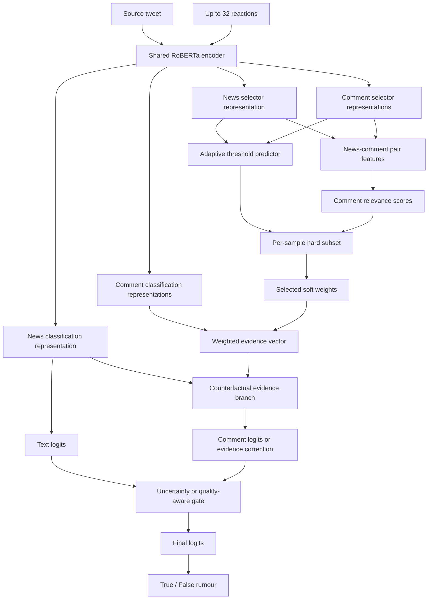

# PHEME 动态评论子集选择与真实性分类

本项目研究一个具体问题：在 PHEME 谣言真实性分类中，能否从一条 source tweet 的多条 reactions 中动态选择少量有效评论，并让这些评论真正改善最终预测，而不是仅由新闻文本分支完成分类。

当前模型保留了最初在 Weibo21 上验证过的总体流程：

```text
新闻编码 → 评论逐条评分 → 动态子集选择 → 评论证据聚合 → 文本/评论融合 → 真实性分类
```

针对 PHEME，项目已经修正任务标签、数据划分、无评论回退、评论专属监督和硬子集预算。当前尚未完全解决的问题是：评论分支可以独立学到有效信息，selector 也能压缩评论数量，但评论对最终分类的稳定增益仍不明显。

> 当前主实验使用全事件混合划分，只用 Dev 选择模型和超参数。Test 在配置完全冻结前不参与实验。

## 目录

- [任务定义](#任务定义)
- [当前实验结论](#当前实验结论)
- [整体架构](#整体架构)
- [模型各模块](#模型各模块)
- [训练目标](#训练目标)
- [数据格式与划分](#数据格式与划分)
- [快速开始](#快速开始)
- [结果评估](#结果评估)
- [从 Weibo21 迁移到 PHEME 时的问题](#从-weibo21-迁移到-pheme-时的问题)
- [项目结构](#项目结构)
- [已知限制与下一步](#已知限制与下一步)

## 任务定义

本项目使用 PHEME rumours 中的二分类真实性任务：

| 标签 | 含义 |
|---|---|
| `0` | true rumour，最终被证实为真 |
| `1` | false rumour，最终被证实为假 |

以下样本不进入本任务：

- non-rumour；
- unverified rumour；
- 缺失 source tweet 或无法解析的记录。

这不是“rumour / non-rumour”检测，也不是历史代码中曾使用的“false / true+non-rumour”混合标签任务。

## 当前实验结论

在 `data/pheme_veracity_mixed` 的 Dev 上，当前模型表现出三个不同层面的能力：

1. **文本分支有效**：RoBERTa 的 source tweet 表示已经能够取得较高 Macro-F1。
2. **评论分支有信息**：仅使用聚合评论证据时，Macro-F1 约为 `0.91～0.92`，说明评论编码器不是完全无效。
3. **选择器能压缩**：selector 可以将平均保留率降到约 `21.95%`，即从平均约 `10.72` 条评论压缩到约 `2.35` 条。
4. **融合仍是瓶颈**：三个随机种子中，最终预测与 Text-only 分支完全一致，评论没有改变预测。

当前三随机种子 Dev 结果如下：

| Seed | 最终 Macro-F1 | Text 分支 Macro-F1 | Evidence-only Macro-F1 | 评论保留率 |
|---:|---:|---:|---:|---:|
| 42 | 0.940484 | 0.940484 | 0.919021 | 0.219459 |
| 43 | 0.936081 | 0.936081 | 0.918356 | 0.219459 |
| 44 | 0.936383 | 0.936383 | 0.908946 | 0.219459 |

显式强融合实验已经证明评论通路具有改变预测的能力，但当时改变的 1 个样本由正确变为错误：

```text
learned/all Macro-F1 = 0.936383
none Macro-F1        = 0.940484
```

因此，当前问题已经从“评论有没有信息、梯度能不能传到评论分支”进一步定位为“模型何时应该相信评论”。代码中已实现 `quality_aware_counterfactual_fusion` 作为下一步实验头，但它仍属于待验证方案，不能作为已获得稳定增益的最终结果。

## 整体架构



推荐的 PHEME 配置使用：

| 模块 | 当前设置 |
|---|---|
| 共享编码器 | RoBERTa-base |
| Selector 表示 | `bert_cnn_scale_attn` |
| Classifier 表示 | `bert_cls` |
| 评论选择 | `adaptive_threshold` |
| 训练时硬选择 | `straight_through` |
| 每条新闻最少评论数 | `min_selected=3`，评论不足时保留全部可用评论 |
| 最大评论数 | 32 |
| 新闻最大长度 | 256 tokens |
| 评论最大长度 | 96 tokens |
| 主分类头 | `counterfactual_uncertainty_gated_evidence_residual` |
| 实验性融合头 | `counterfactual_evidence_logit_fusion`、`quality_aware_counterfactual_fusion` |

## 模型各模块

### 1. 共享 RoBERTa 编码器

新闻与每条评论分别送入同一个 `AutoModel`。共享参数使新闻和评论处于同一语义空间，同时避免为每条评论单独维护一套大型编码器。

代码位置：[src/model.py](src/model.py)

### 2. 两套任务表示

同一份 RoBERTa token states 会进入两个不同用途的表示头：

- **Selector 表示**负责判断一条评论是否值得保留；
- **Classifier 表示**负责生成新闻向量和评论证据向量。

当前 selector 使用 `bert_cnn_scale_attn`：

1. 取 RoBERTa 的 `[CLS]` 向量；
2. 使用 kernel size 为 `2/3/4` 的一维 CNN 提取不同跨度的局部模式；
3. 根据 `[CLS]` 与多尺度 CNN 均值生成查询向量；
4. 对不同 CNN 尺度做注意力加权；
5. 使用门控残差将 CNN 信息融合回 `[CLS]`。

分类分支使用更直接的 `bert_cls`，减少评论选择模块与最终分类器完全共享同一种归纳偏置的风险。

### 3. 新闻—评论配对特征

对于新闻向量 \(n_i\) 和第 \(j\) 条评论向量 \(c_{ij}\)，构造：

```text
pair(n, c) = [n, c, |n-c|, n*c]
```

其中 `*` 表示逐元素乘法。该表示同时包含：

- 新闻自身语义；
- 评论自身语义；
- 两者的绝对差异；
- 两者的逐维交互。

MLP selector 为每条评论输出一个未归一化分数 \(s_{ij}\)。

### 4. 每条新闻独立的自适应阈值

固定阈值假设所有新闻都需要相同的评论筛选强度，而不同 PHEME 事件的评论数量和噪声差异很大。因此模型为每条新闻预测阈值 \(t_i\)。

阈值网络的输入包含：

```text
[新闻向量,
 评论集合均值,
 |新闻向量-评论均值|,
 新闻向量*评论均值,
 有效评论数量占比]
```

第 \(j\) 条评论的软保留概率为：

```text
p_ij = sigmoid((s_ij - t_i) / T)
```

其中 \(T\) 是 selector temperature。

硬子集首先保留 `s_ij >= t_i` 的评论；如果数量少于 `min_selected`，则按分数补足到可用评论数允许的最小数量。

### 5. Straight-through 硬子集训练

模型训练时真正按硬 mask 前向计算，但使用 straight-through estimator 将梯度传回软概率：

```text
forward:  使用 hard selected subset
backward: 梯度近似通过 soft keep probability
```

这避免了“训练时使用全部评论的软权重，推理时突然改成硬子集”的训练—推理不一致。

验证和推理阶段严格使用导出的硬子集，不会暗中继续使用全部评论。

### 6. 评论证据聚合

选中评论保留其 selector 软分数，并在样本内部归一化：

```text
evidence_i = sum_j(weight_ij * comment_ij)
```

这样 hard mask 决定“哪些评论参与”，soft weight 决定“参与评论各自占多大权重”。

### 7. 反事实评论分支

早期 residual 头直接读取：

```text
[news, evidence, |news-evidence|, news*evidence]
```

即使 evidence 为零，它仍可以从 `news` 部分完成分类，因而可能退化成第二个 Text-only 分类器。为消除这一漏洞，当前反事实分支同时计算：

```text
真实评论证据输出 - 零评论证据输出
```

只有由评论引起的变化才被视为 evidence correction。因此：

```text
没有评论 → evidence correction = 0 → final logits = text logits
```

这个严格回退性质由 [scripts/check_pheme_gated_residual.py](scripts/check_pheme_gated_residual.py) 检查。

### 8. 三种融合头

#### 8.1 反事实不确定度门控残差

`counterfactual_uncertainty_gated_evidence_residual` 是当前稳定主线：

```text
final_logits = text_logits + gate * evidence_delta
```

`gate` 同时考虑网络学习到的门值和 Text-only 的不确定度。`evidence_gate_floor` 可以给评论保留最低通道，避免文本高置信度但预测错误时评论完全无法纠正。

#### 8.2 显式评论 Logit 融合

`counterfactual_evidence_logit_fusion` 不再把评论只当成很小的 residual，而是将评论分支视为独立分类器：

```text
final_logits
= text_logits
 + fusion_scale * gate * (comment_logits - text_logits)
```

当 `fusion_scale=1` 且 `gate` 位于 `[0,1]` 时，它等价于文本和评论 logits 的插值。较大的 scale 可以迫使评论跨过最终分类边界，但也可能放大错误评论。

#### 8.3 质量感知融合

`quality_aware_counterfactual_fusion` 在显式融合上增加“评论是否比文本更可信”的限制：

```text
comment_quality = clamp(2 * (comment_confidence - 0.5), 0, 1)
relative_confidence = sigmoid(
    (comment_confidence - text_confidence) / quality_temperature
)
final_gate = base_gate * comment_quality * relative_confidence
```

该头的目的不是让评论影响更多样本，而是只在评论分支比文本分支更有把握时开放纠正通道。它已经完成代码和契约检查，但仍需要正式多随机种子实验验证。

## 训练目标

动态模型的总损失由主分类损失和可选辅助损失组成：

```text
L = L_classification
  + λ_evidence * L_evidence_only
  + λ_all * L_all_comments
  + λ_consistency * L_subset_consistency
  + λ_utility * L_selector_utility
  + λ_budget * L_selector_balance
  + λ_residual * L_residual_l2
  + λ_rdrop * L_rdrop
```

### 主分类损失

`L_classification` 对最终融合 logits 使用交叉熵。代码也支持 label smoothing、focal loss 和训练集计算的类别权重，但当前 mixed 主实验使用普通交叉熵且 `class_weight_mode=none`。

### 评论独立分类损失

`L_evidence_only` 强制评论证据在不借用 Text logits 的情况下预测真实性标签。它解决“评论分支虽然存在，但完全依赖文本主干”的问题。

### 全评论辅助损失

`L_all_comments` 使用全部有效评论的均匀聚合作为辅助视图，使评论编码器先学会从完整讨论中提取稳定真实性信号。

### 子集一致性损失

`L_subset_consistency` 是动态子集 logits 与全部评论 logits 之间的对称 KL。目标是让较小子集尽量保留完整评论集合中的有效信息。

### Selector utility 损失

模型分别计算每条评论单独使用时的 comment-only 分类损失。分类损失更低的评论获得更高 utility target，selector 再学习匹配该分布。

这比“评论和新闻越相似越重要”更符合任务目标：selector 优先保留真正有助于真实性分类的评论。

### 硬保留率预算

`L_selector_balance` 约束每条新闻的实际硬子集保留率处于指定区间。straight-through 梯度使这个约束能训练 selector，同时前向统计的确是 hard mask，而不是容易被阈值钻空子的软概率均值。

### R-Drop

同一 batch 做两次带 dropout 的前向传播，并用对称 KL 约束两次最终预测。它用于提高小数据集训练稳定性。

## 数据格式与划分

### Mixed 协议

当前主实验采用 `mixed` 划分：按“事件 × 标签”分层，并按规范化 source tweet 分组，避免同一 source tweet 跨 Train/Dev/Test。

| Split | 样本数 | True | False | 评论数 | 无评论样本 |
|---|---:|---:|---:|---:|---:|
| Train | 1195 | 747 | 448 | 14126 | 148 |
| Dev | 255 | 160 | 95 | 3019 | 40 |
| Test | 255 | 160 | 95 | 2974 | 40 |

九个事件都出现在三个划分中。该协议衡量同分布真实性分类，不等价于 leave-one-event-out 或跨事件泛化。

### JSONL 格式

每行是一条 source tweet：

```json
{
  "id": "pheme_charliehebdo_552783667052167168",
  "text": "source tweet text",
  "comments": ["reaction 1", "reaction 2"],
  "comment_labels": [-1, -1],
  "comment_types": ["original", "original"],
  "neutralized_comments": ["", ""],
  "neutralized_comment_validated": [false, false],
  "label": 0,
  "meta": {
    "event": "charliehebdo"
  }
}
```

PHEME 原始评论没有逐条 evidence 标签，因此 `comment_labels=-1` 表示未标注，而不是负评论。

## 快速开始

以下命令以 AutoDL 目录为例：

```bash
cd /root/autodl-tmp/思路4
pip install -r requirements.txt
```

RoBERTa 目录预期为：

```text
/root/autodl-tmp/pretrained_models/roberta-base
```

### 1. 生成 Mixed 数据

```bash
python scripts/convert_pheme.py \
  --input-dir data/pheme/all-rnr-annotated-threads \
  --output-dir data/pheme_veracity_mixed \
  --task veracity_binary \
  --split-strategy mixed \
  --dev-ratio 0.15 \
  --test-ratio 0.15 \
  --seed 42
```

转换结果和标签统计保存在：

```text
data/pheme_veracity_mixed/conversion_report.json
```

### 2. 训练公平的 Text-only 基线

```bash
python -u -m src.train \
  --training-profile pheme_veracity \
  --train data/pheme_veracity_mixed/train.jsonl \
  --dev data/pheme_veracity_mixed/dev.jsonl \
  --model ../pretrained_models/roberta-base \
  --architecture text_only \
  --classifier-representation bert_cls \
  --class-weight-mode none \
  --batch-size 4 \
  --epochs 5 \
  --lr 2e-5 \
  --rdrop-loss-weight 1.0 \
  --max-news-length 256 \
  --output-dir outputs/pheme_mixed_text_s42 \
  --seed 42
```

### 3. 从原始 RoBERTa 训练动态评论模型

为了判断动态架构本身是否有效，这一步不加载 PHEME Text-only checkpoint。

```bash
python -u -m src.train \
  --training-profile pheme_veracity \
  --train data/pheme_veracity_mixed/train.jsonl \
  --dev data/pheme_veracity_mixed/dev.jsonl \
  --model ../pretrained_models/roberta-base \
  --architecture dynamic_evidence \
  --selector-representation bert_cnn_scale_attn \
  --classifier-representation bert_cls \
  --classifier-head counterfactual_uncertainty_gated_evidence_residual \
  --trainable-scope all \
  --train-sampling-mode shuffle \
  --selection-mode adaptive_threshold \
  --selection-training-mode straight_through \
  --min-selected 3 \
  --selector-loss-weight 0 \
  --sparsity-loss-weight 0 \
  --selector-balance-loss-weight 0.1 \
  --selector-min-keep-ratio 0.20 \
  --selector-max-keep-ratio 0.65 \
  --evidence-gate-floor 0.25 \
  --evidence-only-loss-weight 0.5 \
  --all-comments-loss-weight 0.25 \
  --subset-consistency-loss-weight 0.1 \
  --selector-utility-loss-weight 0.5 \
  --selector-utility-temperature 0.5 \
  --evidence-residual-l2-weight 0 \
  --rdrop-loss-weight 0.5 \
  --class-weight-mode none \
  --batch-size 4 \
  --epochs 8 \
  --lr 1e-5 \
  --max-news-length 256 \
  --max-comment-length 96 \
  --max-comments 32 \
  --output-dir outputs/pheme_mixed_dynamic_evidence_s42 \
  --seed 42
```

### 4. 只训练 selector，压缩硬子集

如果动态模型已经学会评论证据，但保留率过高，可冻结编码器和分类分支，只训练 selector 与阈值网络：

```bash
python -u -m src.train \
  --training-profile pheme_veracity \
  --train data/pheme_veracity_mixed/train.jsonl \
  --dev data/pheme_veracity_mixed/dev.jsonl \
  --model ../pretrained_models/roberta-base \
  --architecture dynamic_evidence \
  --selector-representation bert_cnn_scale_attn \
  --classifier-representation bert_cls \
  --classifier-head counterfactual_uncertainty_gated_evidence_residual \
  --init-checkpoint outputs/pheme_mixed_dynamic_evidence_s42 \
  --trainable-scope selector_only \
  --selection-mode adaptive_threshold \
  --selection-training-mode straight_through \
  --min-selected 3 \
  --selector-loss-weight 0 \
  --sparsity-loss-weight 0 \
  --selector-balance-loss-weight 1.0 \
  --selector-min-keep-ratio 0.35 \
  --selector-max-keep-ratio 0.35 \
  --evidence-gate-floor 0.25 \
  --evidence-only-loss-weight 0.5 \
  --subset-consistency-loss-weight 0.1 \
  --selector-utility-loss-weight 0.5 \
  --selector-utility-temperature 0.5 \
  --rdrop-loss-weight 0 \
  --class-weight-mode none \
  --batch-size 4 \
  --epochs 5 \
  --lr 1e-4 \
  --max-news-length 256 \
  --max-comment-length 96 \
  --max-comments 32 \
  --output-dir outputs/pheme_mixed_selector_budget_s42 \
  --seed 42
```

注意：由于 `min_selected=3`，评论数量较少的样本不能达到严格的 35% 保留率。因此数据集总体实际保留率可能低于或高于目标值，不能把 `0.35` 直接理解成全局固定 Top-K。

## 结果评估

### 查看最佳 Dev 指标

```bash
cat outputs/pheme_mixed_selector_budget_s42/metrics.json
```

训练程序按 Dev Macro-F1 保存最佳 checkpoint。若 `trainable_scope=selector_only` 且 Macro-F1 完全相同，则优先保存评论保留率更低的 checkpoint。

### 评论选择消融

```bash
python scripts/evaluate_selection_ablation.py \
  --data data/pheme_veracity_mixed/dev.jsonl \
  --checkpoint outputs/pheme_mixed_selector_budget_s42 \
  --output outputs/pheme_mixed_selector_budget_s42/selection_ablation.json \
  --policies learned all none \
  --batch-size 8
```

三种策略含义：

| Policy | 含义 | 回答的问题 |
|---|---|---|
| `learned` | 使用模型学习到的硬子集 | 当前完整模型表现如何？ |
| `all` | 保留全部评论，但保持模型的软融合权重 | selector 删除评论是否有收益？ |
| `none` | 评论证据向量置零 | 评论整体是否改善文本预测？ |

正确解读顺序：

```text
learned > none：评论整体带来净增益
learned > all：动态子集优于使用全部评论
all > none：评论有用，但 selector 可能删掉了有用评论
learned = all = none：最终决策仍由文本分支控制
none > learned/all：评论融合正在伤害预测
```

还应同时检查：

| 指标 | 含义 |
|---|---|
| `text_branch_macro_f1` | 不使用评论修正时的文本分支表现 |
| `evidence_only_macro_f1` | 仅评论证据分支的独立分类能力 |
| `selection_keep_ratio` | 实际硬子集保留比例 |
| `comment_prediction_change_rate` | 评论使最终类别发生变化的样本比例 |
| `comment_help_count` | 评论将错误文本预测纠正为正确的数量 |
| `comment_hurt_count` | 评论将正确文本预测改错的数量 |
| `mean_evidence_correction_norm` | 评论对最终 logits 的平均修正强度 |

### 契约检查

修改模型结构后，至少运行：

```bash
python scripts/check_pheme_gated_residual.py
python scripts/check_adaptive_selector.py
```

它们检查：

- 无评论时严格回退到 Text-only；
- 评论残差存在有效梯度；
- 自适应阈值可以按样本变化；
- `min_selected` 正确生效；
- straight-through 硬预算能够反向传播；
- `learned/all/none/top_k` 推理策略符合约定；
- 显式融合和质量感知 gate 符合公式。

## 从 Weibo21 迁移到 PHEME 时的问题

### 1. 最初任务定义不一致

早期转换把 non-rumour 和 true rumour 混到同一类，使模型实际上解决了另一个任务。现在严格限定为 true rumour 对 false rumour，并排除 non-rumour 与 unverified。

### 2. PHEME 没有 Weibo21 式的评论级监督

Weibo21 实验包含生成干扰评论、评论类型或 selector 监督，selector 可以直接学习“应该拒绝什么”。PHEME reactions 默认只有事件级真实性标签，没有逐条 evidence 标签。

因此 PHEME profile 默认关闭：

```text
max_selector_negatives = 0
selector_loss_weight = 0
```

并新增 `evidence_only` 与 `selector_utility`，从最终任务标签间接学习评论价值。

### 3. 固定阈值不适应不同事件

不同事件的评论数量、语气和信息密度差异明显。固定 `0.5` 容易在某些事件全选、另一些事件全不选，因此改为按新闻和评论集合预测阈值。

### 4. Soft selection 与真实 hard subset 不一致

旧训练可能通过大量小概率评论形成证据，但推理时只保留少量评论，造成训练—推理错位。现在使用 straight-through：前向就是 hard subset，反向仍能更新 selector。

### 5. 旧 residual 可以偷看新闻

旧评论残差分支即使没有评论也能读取新闻向量，因而可能伪装成评论分支，实际却是第二个文本分类器。反事实差分使评论修正只包含真实评论相对于零评论基线造成的变化。

### 6. Text-only 太强，评论较弱

Mixed 划分中 source tweet 本身已经有约 `0.94` Macro-F1，而 evidence-only 约为 `0.91～0.92`。普通门控为了降低训练损失，最安全的策略就是忽略评论。这解释了为什么评论分支看似训练成功，最终预测却与 Text-only 完全一致。

### 7. 强行放大评论不等于有效融合

提高 gate floor 或 fusion scale 确实能让评论改变预测，但当前强融合首先改变的是一个原本正确的样本，导致 `none > learned`。因此下一步不能继续盲目放大评论，而要学习“在哪些样本上 defer to comments”。

### 8. 旧 0.95 结果不能直接比较

历史约 `0.95` 的结果来自不同的 Hybrid Train/Dev 划分，并加载了已在 PHEME 上微调的 Text-only checkpoint。当前 Mixed 实验使用不同样本划分，并要求动态模型从原始 RoBERTa 开始，因此两者不能作为同一实验表中的直接提升关系。

## 项目结构

```text
.
├── src/
│   ├── config.py          # 训练配置数据类
│   ├── data.py            # JSONL 读取、tokenize、comment mask
│   ├── model.py           # 表示层、selector、阈值、融合头、损失
│   ├── train.py           # 当前训练入口
│   └── train_ver2.py      # 原始备份，不应修改
├── scripts/
│   ├── convert_pheme.py
│   ├── evaluate_selection_ablation.py
│   ├── evaluate_text_checkpoint.py
│   ├── check_adaptive_selector.py
│   └── check_pheme_gated_residual.py
├── data/
│   ├── pheme/
│   └── pheme_veracity_mixed/
├── outputs/               # checkpoint、config 和指标
├── PHEME实验说明.md        # 实验演进和服务器命令记录
├── weibo21实验架构最佳设置.md
└── requirements.txt
```

训练输出目录包含：

```text
config.json       完整训练配置
metrics.json      最佳 Dev 指标
model.pt          完整模型参数
encoder/          Hugging Face 编码器和 tokenizer
test_metrics.json 仅在显式传入 --test 时生成
```

## 已知限制与下一步

当前已经解决：

- PHEME 二分类标签定义错误；
- source tweet 跨划分重复；
- reaction 时间排序和大整数 ID 解析；
- 固定阈值不适配不同新闻；
- hard subset 的训练—推理不一致；
- residual 分支在无评论时偷用新闻；
- selector 软预算无法约束真实硬子集；
- 缺少评论分支独立能力和实际贡献指标。

当前仍未解决：

- 评论分支虽有信息，但其置信度通常低于强 Text-only 分支；
- selector 压缩评论后，最终类别仍常与 Text-only 完全一致；
- 强融合可以改变决策，但尚未实现稳定的 `help > hurt`；
- `quality_aware_counterfactual_fusion` 需要多随机种子验证；
- 当前 Dev 已参与多轮结构选择，最终论文结果需要冻结超参数后使用未参与调参的 Test。

推荐下一步不再继续单纯调大 `fusion_scale`，而是训练一个显式的“是否让评论接管当前样本”门控目标：只有当评论分支正确且文本分支错误时，监督 gate 开放；文本正确而评论错误时，监督 gate 关闭。该实验应先在 Dev 验证 `comment_help_count > comment_hurt_count`，再进行多随机种子和最终 Test 评估。

