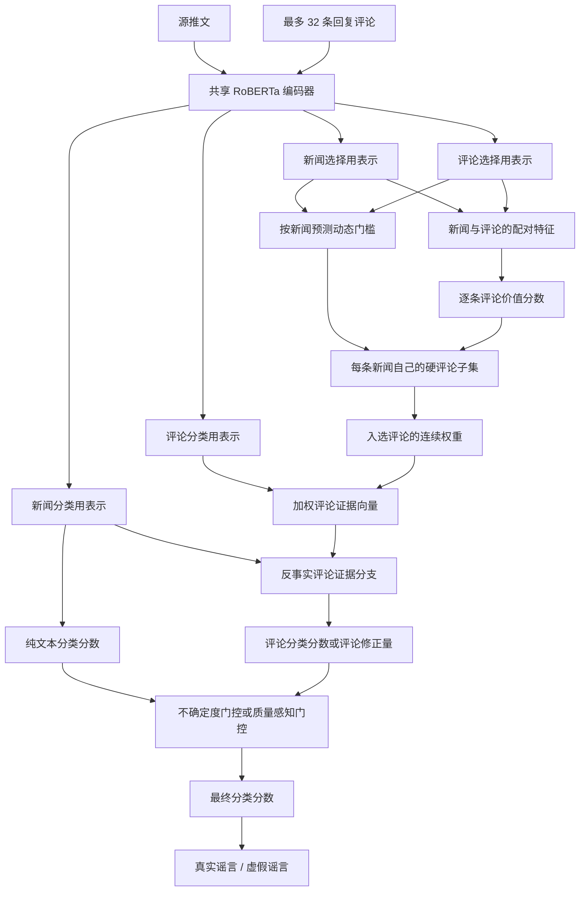

# PHEME 动态评论子集选择与真实性分类

本项目研究一个具体问题：在 PHEME 谣言真实性分类中，能否从一条源推文的多条回复中，针对每条源推文动态挑选少量真正有用的评论，并让这些评论实际改善最终预测，而不是表面上建立了评论分支，最后仍完全依靠源推文文本分类。

当前模型保留了最初在 Weibo21 上验证过的总体流程：

```text
新闻编码 → 评论逐条评分 → 动态子集选择 → 评论证据聚合 → 文本/评论融合 → 真实性分类
```

针对 PHEME，项目已经修正任务标签、数据划分、无评论严格回退、评论专属监督和真实硬子集预算。当前尚未完全解决的问题是：评论分支可以独立学到有效信息，评论选择器也能压缩评论数量，但融合模块仍不能稳定判断“什么时候应该相信评论”。

> 当前主实验使用全事件混合划分，只用验证集选择模型和超参数。测试集在配置完全冻结前不参与实验。

## 目录

- [任务定义](#任务定义)
- [通俗术语对照](#通俗术语对照)
- [当前实验结论](#当前实验结论)
- [整体架构](#整体架构)
- [模型各模块](#模型各模块)
- [训练目标](#训练目标)
- [数据格式与划分](#数据格式与划分)
- [快速开始](#快速开始)
- [结果评估](#结果评估)
- [从 Weibo21 迁移到 PHEME 时的问题](#从-weibo21-迁移到-pheme-时的问题)
- [项目结构](#项目结构)
- [已知限制与下一步](#已知限制与下一步)

## 任务定义

本项目使用 PHEME 谣言样本中的二分类真实性任务：

| 标签 | 含义 |
|---|---|
| `0` | 真实谣言，即该传闻最终被证实为真 |
| `1` | 虚假谣言，即该传闻最终被证实为假 |

以下样本不进入本任务：

- 非谣言样本；
- 最终未核实的谣言；
- 缺失源推文或无法解析的记录。

这不是“谣言 / 非谣言”检测，也不是历史代码中曾使用的“虚假谣言 / 真实谣言加非谣言”混合标签任务。

## 通俗术语对照

代码参数必须保留英文拼写，但正文尽量使用下面的中文说法：

| 代码或论文术语 | 本文中的通俗说法 | 实际含义 |
|---|---|---|
| source tweet | 源推文 | 一条讨论线程最开始的推文 |
| reaction/comment | 回复评论 | 用户对源推文的回复 |
| Text-only | 纯文本模型或纯文本分支 | 只阅读源推文，不使用回复评论 |
| selector | 评论选择器 | 给每条评论打分并决定是否保留 |
| adaptive threshold | 动态门槛 | 每条新闻自己预测一个筛选门槛 |
| hard subset | 硬评论子集 | 评论要么入选、要么完全不参与 |
| soft weight | 连续权重 | 入选评论在聚合时所占的比重 |
| evidence | 评论证据 | 多条评论加权汇总得到的信息 |
| logits | 分类分数 | 归一化成概率之前的类别分数 |
| gate | 门控 | 决定评论修正能进入最终预测多少 |
| residual/correction | 残差或评论修正量 | 评论在纯文本结果上增加的改变量 |
| checkpoint | 模型保存点 | 某轮保存的参数、配置和指标 |
| Dev/Test | 验证集/测试集 | 调参与最终一次评估所用数据 |
| Macro-F1 | 宏平均 F1 | 先分别计算两类 F1，再等权平均 |
| learned/all/none | 学习子集/全部评论/关闭评论 | 三种评论消融策略 |

下文首次出现关键代码参数时，会同时说明它的中文含义。

## 当前实验结论

在 `data/pheme_veracity_mixed` 的验证集上，当前模型表现出四个不同层面的能力：

1. **纯文本分支有效**：RoBERTa 只阅读源推文时，已经能够取得约 `0.94` 的宏平均 F1。
2. **评论分支确实学到了信息**：只使用聚合评论证据时，宏平均 F1 约为 `0.91～0.92`，说明评论编码器不是摆设。
3. **评论选择器能够压缩**：选择器可以将平均保留率降到约 `21.95%`，即从平均约 `10.72` 条评论压缩到约 `2.35` 条。
4. **文本与评论的融合仍是瓶颈**：三个随机种子中，最终预测与纯文本分支完全一致，评论没有改变任何最终类别。

当前三个随机种子的验证集结果如下：

| 随机种子 | 最终宏平均 F1 | 纯文本分支宏平均 F1 | 仅评论证据宏平均 F1 | 评论保留率 |
|---:|---:|---:|---:|---:|
| 42 | 0.940484 | 0.940484 | 0.919021 | 0.219459 |
| 43 | 0.936081 | 0.936081 | 0.918356 | 0.219459 |
| 44 | 0.936383 | 0.936383 | 0.908946 | 0.219459 |

显式强融合实验已经证明评论通路具备改变预测的能力，但当时改变的 1 个样本由正确变为错误：

```text
学习到的子集/全部评论：宏平均 F1 = 0.936383
关闭评论：宏平均 F1             = 0.940484
```

因此，当前问题已经从“评论有没有信息、梯度能不能传到评论分支”进一步定位为“模型在什么情况下应该相信评论、在什么情况下应该继续相信源推文”。代码中已实现“质量感知反事实融合头” `quality_aware_counterfactual_fusion`，但它仍属于待验证方案，不能写成已经获得稳定提升的最终结果。

## 整体架构



推荐的 PHEME 配置使用：

| 模块 | 当前设置 |
|---|---|
| 共享编码器 | RoBERTa-base |
| 评论选择器使用的表示 | `bert_cnn_scale_attn` |
| 最终分类器使用的表示 | `bert_cls` |
| 评论选择 | `adaptive_threshold` |
| 训练时硬选择 | `straight_through` |
| 每条新闻最少评论数 | `min_selected=3`，评论不足时保留全部可用评论 |
| 最大评论数 | 32 |
| 新闻最大长度 | 256 个子词单元 |
| 评论最大长度 | 96 个子词单元 |
| 主分类头 | `counterfactual_uncertainty_gated_evidence_residual` |
| 实验性融合头 | `counterfactual_evidence_logit_fusion`、`quality_aware_counterfactual_fusion` |

## 模型各模块

### 1. 共享 RoBERTa 编码器

新闻与每条评论分别送入同一个 `AutoModel`。共享参数使新闻和评论处于同一语义空间，同时避免为每条评论单独维护一套大型编码器。

代码位置：[src/model.py](src/model.py)

### 2. 两套任务表示

同一份 RoBERTa 词元上下文表示会进入两个不同用途的表示头：

- **评论选择表示**负责判断一条评论是否值得保留；
- **最终分类表示**负责生成新闻向量和评论证据向量。

当前评论选择器使用 `bert_cnn_scale_attn`：

1. 取 RoBERTa 的 `[CLS]` 向量；
2. 使用卷积窗口大小为 `2/3/4` 的一维卷积网络提取不同跨度的局部模式；
3. 根据 `[CLS]` 与多尺度 CNN 均值生成查询向量；
4. 对不同卷积尺度做注意力加权；
5. 使用门控残差将卷积信息融合回 `[CLS]`。

分类分支使用更直接的 `bert_cls`，减少评论选择模块与最终分类器完全共享同一种归纳偏置的风险。

### 3. 新闻—评论配对特征

对于新闻向量 \(n_i\) 和第 \(j\) 条评论向量 \(c_{ij}\)，构造：

```text
pair(n, c) = [n, c, |n-c|, n*c]
```

其中 `*` 表示逐元素乘法。该表示同时包含：

- 新闻自身语义；
- 评论自身语义；
- 两者的绝对差异；
- 两者的逐维交互。

多层感知机评论选择器为每条评论输出一个未归一化分数 \(s_{ij}\)。

### 4. 每条新闻独立的自适应阈值

固定阈值假设所有新闻都需要相同的评论筛选强度，而不同 PHEME 事件的评论数量和噪声差异很大。因此模型为每条新闻预测阈值 \(t_i\)。

阈值网络的输入包含：

```text
[新闻向量,
 评论集合均值,
 |新闻向量-评论均值|,
 新闻向量*评论均值,
 有效评论数量占比]
```

第 \(j\) 条评论的软保留概率为：

```text
p_ij = sigmoid((s_ij - t_i) / T)
```

其中 \(T\) 是控制概率分布平滑程度的“温度参数”。

硬子集首先保留 `s_ij >= t_i` 的评论；如果数量少于 `min_selected`，则按分数补足到可用评论数允许的最小数量。

### 5. 直通估计：前向使用硬子集，反向仍能训练

模型训练时真正按“选中/未选中”的硬掩码计算，但使用直通估计方法将梯度传回连续保留概率：

```text
前向计算：使用实际选中的硬评论子集
反向传播：梯度近似通过连续保留概率传回选择器
```

这避免了“训练时使用全部评论的软权重，推理时突然改成硬子集”的训练—推理不一致。

验证和推理阶段严格使用导出的硬子集，不会暗中继续使用全部评论。

### 6. 评论证据聚合

选中的评论仍保留选择器给出的连续权重，并在同一条新闻内部归一化：

```text
evidence_i = sum_j(weight_ij * comment_ij)
```

这样，硬掩码决定“哪些评论参与”，连续权重决定“参与评论各自占多大比重”。

### 7. 反事实评论分支

早期的评论残差头直接读取：

```text
[新闻, 评论证据, |新闻-评论证据|, 新闻*评论证据]
```

即使评论证据为零，它仍可以从新闻部分完成分类，因而可能退化成第二个纯文本分类器。为消除这一漏洞，当前反事实分支同时计算：

```text
真实评论证据输出 - 零评论证据输出
```

只有由评论引起的变化才被视为“评论修正量”。因此：

```text
没有评论 → 评论修正量为 0 → 最终分类分数严格等于纯文本分类分数
```

这个严格回退性质由 [scripts/check_pheme_gated_residual.py](scripts/check_pheme_gated_residual.py) 检查。

### 8. 三种融合头

#### 8.1 反事实不确定度门控残差

`counterfactual_uncertainty_gated_evidence_residual` 是当前稳定主线：

```text
final_logits = text_logits + gate * evidence_delta
```

门控值同时考虑网络学习到的基础门值和纯文本分支的不确定程度。参数 `evidence_gate_floor` 可以给评论保留最低通道，避免文本高置信度但预测错误时评论完全无法纠正。

#### 8.2 显式评论分类分数融合

`counterfactual_evidence_logit_fusion` 不再把评论只当成很小的修正项，而是将评论分支视为一个独立分类器：

```text
final_logits
= text_logits
 + fusion_scale * gate * (comment_logits - text_logits)
```

当 `fusion_scale=1` 且门控值位于 `[0,1]` 时，它等价于在文本分类分数和评论分类分数之间加权。较大的融合强度可以迫使评论跨过最终分类边界，但也可能放大错误评论。

#### 8.3 质量感知融合

`quality_aware_counterfactual_fusion` 在显式融合上增加“评论是否比文本更可信”的限制：

```text
comment_quality = clamp(2 * (comment_confidence - 0.5), 0, 1)
relative_confidence = sigmoid(
    (comment_confidence - text_confidence) / quality_temperature
)
final_gate = base_gate * comment_quality * relative_confidence
```

该融合头的目的不是让评论影响更多样本，而是只在评论分支比文本分支更有把握时开放纠正通道。它已经完成代码行为检查，但仍需要正式的多随机种子实验验证。

## 训练目标

动态模型的总损失由主分类损失和可选辅助损失组成：

```text
L = L_classification
  + λ_evidence * L_evidence_only
  + λ_all * L_all_comments
  + λ_consistency * L_subset_consistency
  + λ_utility * L_selector_utility
  + λ_budget * L_selector_balance
  + λ_residual * L_residual_l2
  + λ_rdrop * L_rdrop
```

### 主分类损失

主分类损失对最终融合后的分类分数使用交叉熵。代码也支持标签平滑、难样本聚焦损失和按训练集计算的类别权重，但当前全事件混合主实验使用普通交叉熵，并且不使用类别权重。

### 评论独立分类损失

评论独立分类损失强制评论证据在不借用纯文本分类分数的情况下预测真实性标签。它解决“评论分支虽然存在，但实际上完全依赖文本主干”的问题。

### 全评论辅助损失

`L_all_comments` 使用全部有效评论的均匀聚合作为辅助视图，使评论编码器先学会从完整讨论中提取稳定真实性信号。

### 子集一致性损失

子集一致性损失衡量“动态评论子集预测”与“全部评论预测”之间的差异。目标是让较小子集尽量保留完整评论集合中的有效信息。

### 评论价值排序损失

模型分别计算每条评论单独使用时的分类损失。单独使用时分类损失更低的评论，被视为对当前样本更有价值；评论选择器再学习把这类评论排在前面。

这比“评论和新闻越相似越重要”更符合任务目标：评论选择器优先保留真正有助于真实性分类的评论。

### 硬保留率预算

硬保留率预算约束每条新闻的实际评论保留比例处于指定区间。直通估计使这个约束既能训练评论选择器，前向统计的又确实是硬选择结果，而不是容易被阈值钻空子的连续概率均值。

### 两次随机失活一致性训练（R-Drop）

同一批样本做两次带随机失活的前向传播，并约束两次最终预测保持一致。它用于提高小数据集训练稳定性。

## 数据格式与划分

### 全事件混合划分

当前主实验采用 `mixed`（全事件混合）划分：按“事件 × 标签”分层，并按规范化后的源推文分组，避免同一源推文跨训练集、验证集和测试集。

| Split | 样本数 | True | False | 评论数 | 无评论样本 |
|---|---:|---:|---:|---:|---:|
| Train | 1195 | 747 | 448 | 14126 | 148 |
| 验证集 | 255 | 160 | 95 | 3019 | 40 |
| 测试集 | 255 | 160 | 95 | 2974 | 40 |

九个事件都出现在三个划分中。该协议衡量同分布真实性分类，不等价于 leave-one-event-out 或跨事件泛化。

### JSONL 格式

每行是一条源推文及其回复评论：

```json
{
  "id": "pheme_charliehebdo_552783667052167168",
  "text": "source tweet text",
  "comments": ["reaction 1", "reaction 2"],
  "comment_labels": [-1, -1],
  "comment_types": ["original", "original"],
  "neutralized_comments": ["", ""],
  "neutralized_comment_validated": [false, false],
  "label": 0,
  "meta": {
    "event": "charliehebdo"
  }
}
```

PHEME 原始评论没有逐条 evidence 标签，因此 `comment_labels=-1` 表示未标注，而不是负评论。

## 快速开始

以下命令以 AutoDL 目录为例：

```bash
cd /root/autodl-tmp/思路4
pip install -r requirements.txt
```

RoBERTa 目录预期为：

```text
/root/autodl-tmp/pretrained_models/roberta-base
```

### 1. 生成全事件混合数据

```bash
python scripts/convert_pheme.py \
  --input-dir data/pheme/all-rnr-annotated-threads \
  --output-dir data/pheme_veracity_mixed \
  --task veracity_binary \
  --split-strategy mixed \
  --dev-ratio 0.15 \
  --test-ratio 0.15 \
  --seed 42
```

转换结果和标签统计保存在：

```text
data/pheme_veracity_mixed/conversion_report.json
```

### 2. 训练公平的纯文本基线

```bash
python -u -m src.train \
  --training-profile pheme_veracity \
  --train data/pheme_veracity_mixed/train.jsonl \
  --dev data/pheme_veracity_mixed/dev.jsonl \
  --model ../pretrained_models/roberta-base \
  --architecture text_only \
  --classifier-representation bert_cls \
  --class-weight-mode none \
  --batch-size 4 \
  --epochs 5 \
  --lr 2e-5 \
  --rdrop-loss-weight 1.0 \
  --max-news-length 256 \
  --output-dir outputs/pheme_mixed_text_s42 \
  --seed 42
```

### 3. 从原始 RoBERTa 训练动态评论模型

为了判断动态架构本身是否有效，这一步不加载已经在 PHEME 上微调过的纯文本模型参数。

```bash
python -u -m src.train \
  --training-profile pheme_veracity \
  --train data/pheme_veracity_mixed/train.jsonl \
  --dev data/pheme_veracity_mixed/dev.jsonl \
  --model ../pretrained_models/roberta-base \
  --architecture dynamic_evidence \
  --selector-representation bert_cnn_scale_attn \
  --classifier-representation bert_cls \
  --classifier-head counterfactual_uncertainty_gated_evidence_residual \
  --trainable-scope all \
  --train-sampling-mode shuffle \
  --selection-mode adaptive_threshold \
  --selection-training-mode straight_through \
  --min-selected 3 \
  --selector-loss-weight 0 \
  --sparsity-loss-weight 0 \
  --selector-balance-loss-weight 0.1 \
  --selector-min-keep-ratio 0.20 \
  --selector-max-keep-ratio 0.65 \
  --evidence-gate-floor 0.25 \
  --evidence-only-loss-weight 0.5 \
  --all-comments-loss-weight 0.25 \
  --subset-consistency-loss-weight 0.1 \
  --selector-utility-loss-weight 0.5 \
  --selector-utility-temperature 0.5 \
  --evidence-residual-l2-weight 0 \
  --rdrop-loss-weight 0.5 \
  --class-weight-mode none \
  --batch-size 4 \
  --epochs 8 \
  --lr 1e-5 \
  --max-news-length 256 \
  --max-comment-length 96 \
  --max-comments 32 \
  --output-dir outputs/pheme_mixed_dynamic_evidence_s42 \
  --seed 42
```

### 4. 只训练评论选择器，压缩硬子集

如果动态模型已经学会评论证据，但保留率过高，可冻结编码器和分类分支，只训练评论选择器与阈值网络：

```bash
python -u -m src.train \
  --training-profile pheme_veracity \
  --train data/pheme_veracity_mixed/train.jsonl \
  --dev data/pheme_veracity_mixed/dev.jsonl \
  --model ../pretrained_models/roberta-base \
  --architecture dynamic_evidence \
  --selector-representation bert_cnn_scale_attn \
  --classifier-representation bert_cls \
  --classifier-head counterfactual_uncertainty_gated_evidence_residual \
  --init-checkpoint outputs/pheme_mixed_dynamic_evidence_s42 \
  --trainable-scope selector_only \
  --selection-mode adaptive_threshold \
  --selection-training-mode straight_through \
  --min-selected 3 \
  --selector-loss-weight 0 \
  --sparsity-loss-weight 0 \
  --selector-balance-loss-weight 1.0 \
  --selector-min-keep-ratio 0.35 \
  --selector-max-keep-ratio 0.35 \
  --evidence-gate-floor 0.25 \
  --evidence-only-loss-weight 0.5 \
  --subset-consistency-loss-weight 0.1 \
  --selector-utility-loss-weight 0.5 \
  --selector-utility-temperature 0.5 \
  --rdrop-loss-weight 0 \
  --class-weight-mode none \
  --batch-size 4 \
  --epochs 5 \
  --lr 1e-4 \
  --max-news-length 256 \
  --max-comment-length 96 \
  --max-comments 32 \
  --output-dir outputs/pheme_mixed_selector_budget_s42 \
  --seed 42
```

注意：由于 `min_selected=3`，评论数量较少的样本不能达到严格的 35% 保留率。因此数据集总体实际保留率可能低于或高于目标值，不能把 `0.35` 直接理解成全局固定 Top-K。

## 结果评估

### 查看最佳验证集指标

```bash
cat outputs/pheme_mixed_selector_budget_s42/metrics.json
```

训练程序按验证集宏平均 F1 保存最佳模型。若 `trainable_scope=selector_only` 且宏平均 F1 完全相同，则优先保存评论保留率更低的模型。

### 评论选择消融

```bash
python scripts/evaluate_selection_ablation.py \
  --data data/pheme_veracity_mixed/dev.jsonl \
  --checkpoint outputs/pheme_mixed_selector_budget_s42 \
  --output outputs/pheme_mixed_selector_budget_s42/selection_ablation.json \
  --policies learned all none \
  --batch-size 8
```

三种策略含义：

| Policy | 含义 | 回答的问题 |
|---|---|---|
| `learned`（学习子集） | 使用模型学习到的硬子集 | 当前完整模型表现如何？ |
| `all`（全部评论） | 保留全部评论，但保持模型的连续融合权重 | 评论选择器删除评论是否有收益？ |
| `none`（关闭评论） | 评论证据向量置零 | 评论整体是否改善文本预测？ |

正确解读顺序：

```text
学习子集 > 关闭评论：评论整体带来净增益
学习子集 > 全部评论：动态子集优于使用全部评论
全部评论 > 关闭评论：评论有用，但评论选择器可能删掉了有用评论
三者完全相同：最终决策仍由文本分支控制
关闭评论 > 使用评论：评论融合正在伤害预测
```

还应同时检查：

| 指标 | 含义 |
|---|---|
| `text_branch_macro_f1` | 不使用评论修正时的文本分支表现 |
| `evidence_only_macro_f1` | 仅评论证据分支的独立分类能力 |
| `selection_keep_ratio` | 实际硬子集保留比例 |
| `comment_prediction_change_rate` | 评论使最终类别发生变化的样本比例 |
| `comment_help_count` | 评论将错误文本预测纠正为正确的数量 |
| `comment_hurt_count` | 评论将正确文本预测改错的数量 |
| `mean_evidence_correction_norm` | 评论对最终分类分数的平均修正强度 |

### 契约检查

修改模型结构后，至少运行：

```bash
python scripts/check_pheme_gated_residual.py
python scripts/check_adaptive_selector.py
```

它们检查：

- 无评论时严格回退到内部纯文本分支；
- 评论残差存在有效梯度；
- 自适应阈值可以按样本变化；
- `min_selected` 正确生效；
- straight-through 硬预算能够反向传播；
- 学习子集、全部评论、关闭评论和固定前 K 条等推理策略符合约定；
- 显式融合和质量感知门控符合设计公式。

## 从 Weibo21 迁移到 PHEME：问题、判断和解决尝试

Weibo21 上成功的思路不能直接照搬到 PHEME。总体流程没有变，但两个数据集提供的监督、评论组织方式、标签含义和事件分布差异很大。下面按照真实实验顺序说明我们遇到的问题。

### 总览

| 阶段 | 观察到的现象 | 当时定位的问题 | 采取的办法 | 当前结论 |
|---|---|---|---|---|
| 1 | 准确率看似不低，少数类 F1 接近 0 | 标签任务定义错误且类别极不平衡 | 重写 PHEME 转换器和标签规则 | 已解决 |
| 2 | 同一批数据中验证集和测试集差异很大 | 按事件划分带来强烈事件偏移 | 分开同事件验证与跨事件评估 | 认识清楚，但跨事件方向暂停 |
| 3 | `learned/all/none` 几乎一样 | 评论分支没有影响最终决策 | 增加选择消融和评论贡献指标 | 诊断能力已解决 |
| 4 | 换成正确任务后同事件 F1 很高，跨事件仍约 0.40 | 主要是事件领域变化，不只是输入输出错误 | 训练纯文本对照、事件平衡采样 | 证明跨事件是独立难题 |
| 5 | 动态模型加载纯文本最优模型后几乎不变化 | 文本起点过强，评论分支容易被忽略 | 动态模型改为从原始 RoBERTa 训练 | 已用于当前公平实验 |
| 6 | 无评论时评论残差仍能分类 | 评论分支可以偷看新闻 | 引入零评论反事实差分 | 已解决 |
| 7 | 评论单独分类能力不足 | 缺少逐评论监督 | 增加评论独立分类、全部评论和评论价值损失 | 评论分支已学到信息 |
| 8 | 选择器保留全部评论 | 连续概率预算没有约束真实硬子集 | 对硬保留率使用直通估计约束 | 已压缩到约 22% |
| 9 | 单次似乎提升，多随机种子后提升消失 | 评论有信息但融合没有改变类别 | 增加纯文本/评论/最终预测对照指标 | 已定位到融合瓶颈 |
| 10 | 强融合终于改变预测，但把正确样本改错 | “影响强度”不等于“评论可靠性” | 增加质量感知融合 | 已实现，仍待验证 |

### 1. 问题一：最开始做的不是正确的 PHEME 真实性任务

#### 现象

最初转换得到的数据规模很大，但标签高度不平衡：

```text
Train：0 类 3684，1 类 441
Dev：  0 类 325， 1 类 111
Test： 0 类 1081，1 类 86
```

早期模型容易预测多数类，准确率可以达到 `0.72～0.88`，但虚假谣言的 F1 很低，甚至出现 `positive_f1=0`。这说明模型几乎不预测少数类。

#### 根本原因

当时把“非谣言”和“真实谣言”混在标签 0 中，再与“虚假谣言”比较。模型学习的实际上是：

```text
虚假谣言  对  真实谣言+非谣言
```

而我们真正要做的是：

```text
真实谣言  对  虚假谣言
```

这是任务定义错误，不是简单调类别权重就能解决的问题。

#### 解决办法

重写 [`scripts/convert_pheme.py`](scripts/convert_pheme.py)：

- `0 = 最终被证实为真的谣言`；
- `1 = 最终被证实为假的谣言`；
- 排除非谣言；
- 排除最终未核实的谣言；
- 在 `conversion_report.json` 中明确记录标签政策。

#### 结果

修正后，模型不再被要求同时区分“是否为谣言”和“谣言是真是假”。后续同事件验证集的宏平均 F1 从早期约 `0.3～0.5` 提升到 `0.9` 左右，说明任务定义修复是最关键的一步。

### 2. 问题二：原始事件划分导致训练、验证和测试分布差异很大

#### 现象

早期划分中：

- 训练集来自多个事件；
- 验证集完整使用 Germanwings 事件；
- 测试集完整使用 Sydney Siege 事件。

模型在 Germanwings 上表现很差，但在 Sydney 上又可能更高。单看一个数字，很容易误以为代码输入输出仍然错误。

#### 判断办法

我们同时训练了纯文本模型和动态评论模型。如果两个模型在 Germanwings 上都只有约 `0.39～0.41` 的宏平均 F1，说明失败不只是评论选择器造成的，源推文本身也发生了明显的事件领域变化。

当时的跨事件结果大致为：

```text
纯文本：                 0.395789
动态评论，关闭评论：     0.395789
动态评论，学习子集：     0.406191
动态评论，全部评论：     0.409353
```

评论带来了一点变化，但远不足以解决跨事件偏移。

#### 尝试过的办法

- 使用按“事件和标签”平衡的训练采样；
- 冻结纯文本主干，只训练评论残差和选择器；
- 使用文本不确定度控制评论门；
- 在 Germanwings 上比较学习子集、全部评论和关闭评论。

#### 结论

这些尝试没有把跨事件 F1 提升到可接受水平。我们因此暂停把跨事件泛化作为当前主目标，改为先验证“在同分布条件下，动态评论机制本身是否真的有效”。这不是声称跨事件问题已解决，而是明确缩小当前研究问题。

### 3. 问题三：数据划分还要防止重复源推文泄漏

#### 风险

PHEME 中可能出现文本相同或规范化后相同的源推文。如果相同文本同时出现在训练集和验证集，模型可能记住文本，得到虚高结果。

#### 解决办法

新增全事件混合划分：

- 先规范化源推文的大小写和空格；
- 相同源推文作为一个整体分组；
- 按“事件 × 标签”分层；
- 同一个组只能进入训练、验证、测试中的一侧；
- 九个事件尽量同时出现在三个集合中。

当前全事件混合数据为 `1195/255/255`。这种划分回答的是“同分布条件下的真实性分类”，不能与跨事件结果直接比较。

### 4. 问题四：PHEME 没有 Weibo21 中那种逐评论监督

#### Weibo21 为什么更容易训练选择器

Weibo21 阶段使用过生成干扰评论、评论类型或评论级选择标签。选择器能直接学习：

```text
哪些评论应该保留，哪些评论是纯干扰或只有立场没有事实证据
```

#### PHEME 缺少什么

PHEME 原始回复只有整条谣言的真假标签，没有逐条评论证据标签。所有原始回复的 `comment_labels` 都是 `-1`，表示未标注。

如果继续照搬 Weibo21 的负例排序损失，就会把不存在的监督当成存在，或者让相关损失始终为零。

#### 解决办法

PHEME 训练预设关闭历史生成负例监督：

```text
max_selector_negatives = 0
selector_loss_weight = 0
```

再从最终真假标签构造间接监督：

- **评论独立分类损失**：评论证据不借用源推文也要预测真假；
- **全部评论辅助损失**：先让完整评论集合学会提供信息；
- **评论价值排序损失**：单独使用时更能预测正确标签的评论获得更高选择分；
- **子集一致性损失**：少量评论应尽量保留全部评论的有效信息。

#### 结果

仅评论证据的宏平均 F1 提升到约 `0.91～0.92`。因此现在可以确认“评论分支没有学到信息”已经不是主要问题。

### 5. 问题五：固定门槛无法适应不同新闻

#### 现象

不同事件的评论数量和质量差异很大。统一使用 `0.5` 门槛时，有的样本几乎全选，有的样本只剩最低保留数。

#### 解决办法

增加按样本预测的动态门槛 `adaptive_threshold`。门槛网络同时观察：

- 新闻向量；
- 评论集合平均向量；
- 新闻与评论集合的差异和交互；
- 当前有效评论数量占比。

因此每条新闻都有自己的筛选门槛。`min_selected=3` 只负责兜底，不是固定选择前三条。

#### 结果与新问题

动态门槛可以按样本变化，但仅仅“门槛可变”不保证选择器会学到合适的保留数量。后续又出现了所有评论都被保留的问题，因此还需要硬子集预算。

### 6. 问题六：训练时的连续选择与推理时的硬选择不一致

#### 旧机制的问题

旧训练可能让每条评论都以一个不大的连续概率参与聚合。几十条小权重评论相加后仍能形成证据。但推理时真正删除评论，就会出现：

```text
训练时模型看过几乎所有评论
推理时模型只看到少量评论
```

#### 解决办法

使用“直通估计”训练：

- 前向计算真正使用选中/未选中的硬子集；
- 反向传播借用连续保留概率的梯度；
- 验证和推理也严格使用导出的硬子集。

#### 结果

训练和推理现在使用同一种评论集合语义。结构检查也验证了硬选择、最低评论数和空评论样本的行为。

### 7. 问题七：旧评论残差分支可以在没有评论时偷看新闻

#### 发现方式

我们比较了三种推理策略：

```text
learned：使用学习到的评论子集
all：使用全部评论
none：关闭全部评论
```

三种策略预测几乎完全一样。进一步检查旧残差头发现，它的输入中一直包含新闻向量。即使评论证据被置零，残差网络仍能只根据新闻输出一个分类修正量。

#### 为什么这是严重问题

表面上看模型有“评论分支”，实际该分支可能只是第二个纯文本分类器。这样即使评论消融没有变化，也无法判断是评论无用还是网络绕过了评论。

#### 解决办法

增加零评论反事实差分：

```text
真实评论条件下的输出 - 评论证据为零时的输出
```

只有由评论引起的差异才允许进入最终分类。无评论时必须严格满足：

```text
最终分类分数 = 纯文本分类分数
```

#### 结果

这个结构漏洞已经解决，并由 `check_pheme_gated_residual.py` 自动检查。但解决“不能偷看新闻”只保证实验可解释，不会自动保证评论提高 F1。

### 8. 问题八：加载已微调的纯文本最优模型会影响评论学习

#### 为什么最初这样做

先训练一个强纯文本模型，再把它加载到动态模型，理论上可以保留稳定的文本能力，让评论只学习增量修正。

#### 实际影响

纯文本模型已经在同一 PHEME 训练集上达到很高 F1。动态模型从这个起点训练时，最容易降低损失的策略不是学习评论，而是保持原有文本预测不变并把评论门关小。

这解释了为什么若干轮训练的验证指标完全不动，以及为什么学习子集、全部评论、关闭评论得到相同预测。

#### 解决办法

当前全事件混合实验中：

- 纯文本模型单独训练，作为公平对照；
- 动态评论模型不加载 PHEME 纯文本最优 checkpoint；
- 动态模型从原始 RoBERTa 开始联合学习文本、评论和选择器。

#### 注意

加载纯文本 checkpoint 本身不是代码错误，它适合“保住已有文本能力，再训练评论增量”的分阶段实验；但它与“验证动态架构从头是否有效”是两个不同问题，结果不能混在一起比较。

### 9. 问题九：评论分支学会了分类，但选择器发生全选塌缩

#### 现象

加入评论独立分类等损失后，评论证据明显变强：

```text
最终宏平均 F1：          0.936673
内部纯文本宏平均 F1：    0.932298
仅评论证据宏平均 F1：    0.914632
```

但评论保留率为 `1.0`，即选择器把全部评论都留下了。评论可能有帮助，但“动态子集”名存实亡。

#### 旧预算为什么没有约束住

旧保留率损失主要看连续概率。选择器可以让所有评论概率都停在门槛附近：连续平均值看起来不大，硬判断时却全部高于门槛，因此全部入选。

#### 解决办法

把预算改为约束实际硬保留率，同时用直通估计传递梯度；再冻结文本和评论分类分支，只训练评论选择器与动态门槛。

#### 结果

```text
评论保留率：        1.0000 → 0.2195
平均可用评论：      10.72 条
平均选中评论：       2.35 条
```

这说明评论压缩问题已经解决到可用水平。

### 10. 问题十：单个随机种子的评论增益没有复现

#### 最初看起来成功

一次实验中，动态模型的最终宏平均 F1 为 `0.936673`，内部纯文本分支为 `0.932298`，评论纠正了 1 个样本且没有伤害样本。这个结果看起来说明评论带来了小幅提升。

#### 为什么还不能下结论

验证集只有 255 条样本，改变 1 个样本就可能造成几千分之一的 F1 变化。单个随机种子很容易受到初始化、批次顺序和模型保存轮次影响。

#### 三随机种子复验

| 随机种子 | 最终宏平均 F1 | 内部纯文本宏平均 F1 | 仅评论证据宏平均 F1 | 评论改变预测数 |
|---:|---:|---:|---:|---:|
| 42 | 0.940484 | 0.940484 | 0.919021 | 0 |
| 43 | 0.936081 | 0.936081 | 0.918356 | 0 |
| 44 | 0.936383 | 0.936383 | 0.908946 | 0 |

#### 结论

评论分支有独立信息，选择器也能压缩评论，但最终融合层没有让评论跨过任何分类边界。因此不能声称动态评论提高了最终 F1。问题被进一步定位到“融合与信任”，而不是编码或选择器梯度。

### 11. 问题十一：为什么学习子集、全部评论和关闭评论会完全一样

这并不表示三条计算路径完全相同。更准确地说：

- 评论证据向量不同；
- 评论分支输出也可能不同；
- 评论修正量不是严格为零；
- 但修正量太小，或者方向与文本预测一致；
- 因此最终两个类别的大小顺序没有改变。

例如模型对两个类别给出：

```text
纯文本： [5.0, 1.0]
加评论： [4.7, 1.3]
```

分类分数发生了变化，但两者仍预测类别 0，所以 F1 和预测变化数完全一样。

为避免只看 F1 得出错误结论，评估中新增：

- 评论修正量的平均大小；
- 纯文本分支宏平均 F1；
- 仅评论证据宏平均 F1；
- 评论改变预测的比例；
- 评论纠正和评论伤害的样本数。

### 12. 问题十二：固定选前 K 条只是诊断，不是替代动态选择器

实验过程中使用过 `top_k`，它的作用是回答：

```text
如果强制选择固定数量的最高分评论，性能会怎样？
```

它不能替代动态选择器，因为不同新闻的有效评论数不同。当前主模型仍使用动态门槛；固定前 K 条只作为排查“门槛问题还是排序问题”的消融工具。

### 13. 问题十三：强行放大评论终于改变预测，但改变方向错误

#### 尝试

为了判断评论通路是否真的有能力影响分类，我们增加显式评论分类分数融合，并提高评论门控下限和融合强度：

```text
最终分数 = 文本分数
         + 融合强度 × 门控 × (评论分数 - 文本分数)
```

#### 结果

评论终于改变了 1 个样本，但结果为：

```text
使用评论：宏平均 F1 = 0.936383
关闭评论：宏平均 F1 = 0.940484
```

也就是把原本正确的文本预测改错了。

#### 新结论

这次失败反而提供了重要证据：

- 评论编码和融合通路有梯度；
- 评论确实能够改变最终分类；
- 真正缺失的是“评论可靠性判断”；
- 继续盲目调大评论权重只会增加伤害。

### 14. 当前最新尝试：只在评论比文本更可靠时开放门控

新增“质量感知反事实融合” `quality_aware_counterfactual_fusion`：

1. 计算纯文本分支置信度；
2. 计算评论分支置信度；
3. 评论自身接近随机猜测时，压低评论质量；
4. 评论置信度低于文本时，进一步关闭门控；
5. 只有评论明显比文本可靠时，才允许较强修正。

这个机制比单纯增大评论权重更符合当前诊断结果。不过，模型的“高置信度”不一定等于“真的正确”，所以它仍需多随机种子验证。

### 15. 为什么历史约 0.95 的结果不能与当前结果直接比较

历史约 `0.95` 的结果来自：

- 不同的“同事件验证加跨事件评估”混合协议训练集和验证集；
- 不同的样本数量；
- 加载了已在 PHEME 上微调的纯文本 checkpoint；
- 当时评论消融没有证明评论稳定改变预测；
- Germanwings 跨事件表现仍然崩溃。

当前结果来自：

- 全事件混合的 `1195/255/255` 划分；
- 动态模型从原始 RoBERTa 开始；
- 使用三个随机种子；
- 同时报告纯文本、仅评论和最终融合；
- 要求通过学习子集、全部评论和关闭评论消融证明评论贡献。

因此两个 `0.95` 或 `0.94` 数字回答的实验问题不同，不能直接写成“新模型比旧模型下降或提升了多少”。

### 16. 到目前为止，哪些问题真的解决了

#### 已经解决或已建立可靠检查

- 正确的 PHEME 真假谣言任务定义；
- 重复源推文不跨数据集合；
- 回复评论按真实时间排序；
- 动态门槛按新闻变化；
- 训练和推理都使用真实硬评论子集；
- 无评论时严格退化为内部纯文本分支；
- 评论分支可以不依赖源推文学习标签；
- 选择器可以把评论压缩到约 22%；
- 可以分别测量评论信息、评论选择和最终评论贡献。

#### 尚未解决

- 评论分支整体仍弱于纯文本分支；
- 三个随机种子中，评论没有稳定改变最终预测；
- 强制评论介入时，首次改变造成了伤害；
- 当前门控还没有直接学习“文本错、评论对”的接管条件；
- 质量感知融合仍需实验验证。

## 项目结构

```text
.
├── src/
│   ├── config.py          # 训练配置数据类
│   ├── data.py            # JSONL 读取、分词编码和评论掩码
│   ├── model.py           # 表示层、评论选择器、阈值、融合头和损失
│   ├── train.py           # 当前训练入口
│   └── train_ver2.py      # 原始备份，不应修改
├── scripts/
│   ├── convert_pheme.py
│   ├── evaluate_selection_ablation.py
│   ├── evaluate_text_checkpoint.py
│   ├── check_adaptive_selector.py
│   └── check_pheme_gated_residual.py
├── data/
│   ├── pheme/
│   └── pheme_veracity_mixed/
├── outputs/               # 模型保存点、完整配置和指标
├── PHEME实验说明.md        # 实验演进和服务器命令记录
├── weibo21实验架构最佳设置.md
└── requirements.txt
```

训练输出目录包含：

```text
config.json       完整训练配置
metrics.json      最佳验证集指标
model.pt          完整模型参数
encoder/          可被 Transformers 读取的编码器和分词器
test_metrics.json 仅在显式传入测试集参数时生成
```

## 已知限制与下一步

前面的排错过程已经证明：任务定义、数据泄漏、评论编码梯度、硬子集预算和无评论回退都已有明确修复或自动检查。现在最主要的限制集中在“文本与评论如何做可靠决策”。

### 当前限制

1. 纯文本分支的宏平均 F1 约为 `0.94`，高于仅评论证据的 `0.91～0.92`，模型自然倾向相信文本。
2. 评论选择器能把评论压缩到约 22%，但三个随机种子中最终类别仍与内部纯文本分支一致。
3. 增大融合强度能够改变预测，却首先把一个正确样本改错，说明评论介入时机比评论影响强度更重要。
4. 当前“质量感知融合”依据模型置信度控制门值，但神经网络可能高置信度地预测错误，因此置信度不是完美的可靠性标签。
5. 当前验证集已经参与多轮结构选择。最终论文结果必须先冻结所有结构和超参数，再只使用一次未参与调参的测试集。

### 推荐下一步

不再单纯调大 `fusion_scale`，而是增加一个明确学习“是否让评论接管当前样本”的门控目标：

```text
纯文本预测错误、评论预测正确 → 监督门控开放
纯文本预测正确、评论预测错误 → 监督门控关闭
两者都正确或都错误           → 降低该样本的门控监督权重
```

这个目标直接对应当前缺失的能力：不是让评论在所有样本上更强，而是让模型识别“评论比源推文更值得相信”的少量样本。

验收顺序应为：

1. 在验证集检查评论纠正数是否稳定大于评论伤害数；
2. 检查学习子集是否优于关闭评论；
3. 检查学习子集是否不低于全部评论；
4. 使用随机种子 42、43、44 重复实验；
5. 固定结构和全部超参数；
6. 最后只评估一次测试集。
