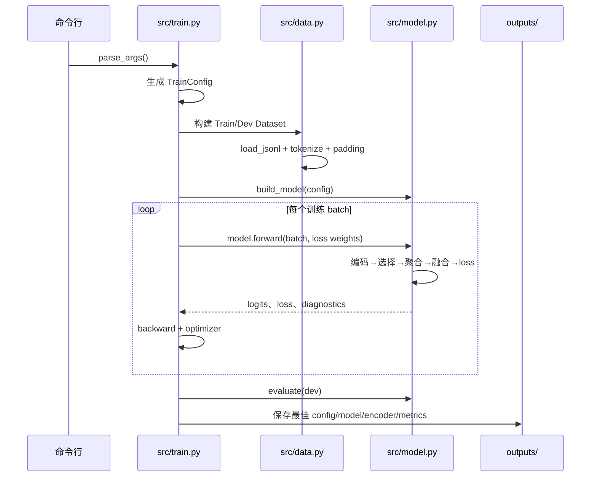

# 第九节课代码介绍：PHEME 实验代码逐文件说明

这份文档从代码角度介绍当前 PHEME 真实性分类实验，重点回答：每个文件负责什么、一条训练命令经过哪些函数、新闻和评论如何变成张量、动态选择和融合如何实现、每项损失监督谁，以及应该如何读输出结果。

当前 PHEME 主线为：

```text
PHEME 原始 thread
→ 转换 JSONL 与 Mixed 划分
→ Dataset tokenize、padding 和 mask
→ 共享 RoBERTa 编码新闻与逐条评论
→ Selector 打分并预测每条新闻自己的阈值
→ Straight-through 形成硬评论子集
→ 加权聚合评论证据
→ 反事实评论分支与 Text 分支融合
→ 主分类和辅助损失
→ Dev Macro-F1 选择 checkpoint
→ learned / all / none 消融
```

## 1. 当前相关文件总览

| 文件 | 作用 | 当前状态 |
|---|---|---|
| [`src/config.py`](src/config.py) | 保存训练、模型和损失配置 | PHEME 主线 |
| [`src/data.py`](src/data.py) | 读 JSONL、整理评论、tokenize、生成 mask | PHEME 主线 |
| [`src/model.py`](src/model.py) | 编码器、selector、阈值、聚合、融合和损失 | PHEME 主线 |
| [`src/train.py`](src/train.py) | 命令行入口、训练、Dev 评估和保存 | PHEME 主线 |
| [`scripts/convert_pheme.py`](scripts/convert_pheme.py) | 将 PHEME 原始目录转换为 JSONL | PHEME 主线 |
| [`scripts/evaluate_selection_ablation.py`](scripts/evaluate_selection_ablation.py) | 比较 learned/all/none/top-k | PHEME 主线 |
| [`scripts/evaluate_text_checkpoint.py`](scripts/evaluate_text_checkpoint.py) | 评估 Text-only checkpoint | PHEME 主线 |
| [`scripts/check_pheme_gated_residual.py`](scripts/check_pheme_gated_residual.py) | 检查无评论回退和融合公式 | 结构检查 |
| [`scripts/check_adaptive_selector.py`](scripts/check_adaptive_selector.py) | 检查动态阈值、硬子集和梯度 | 结构检查 |
| [`scripts/export_evidence.py`](scripts/export_evidence.py) | 恢复配置、导出逐样本评论证据 | 间接支持 |
| [`scripts/analyze_selector.py`](scripts/analyze_selector.py) | 恢复模型并分析 selector | 间接支持 |
| [`PHEME实验说明.md`](PHEME实验说明.md) | 实验演进和 AutoDL 命令 | 实验记录 |
| [`第九节课README.md`](第九节课README.md) | 整体架构、当前结果与快速开始 | 总体说明 |

历史文件：

- [`src/train_ver2.py`](src/train_ver2.py) 是 Weibo21 阶段留下的原始正确版本备份，不应修改；
- `src/train_ver1.py` 和 `src/config_ver1.py` 是更早版本；
- 当前服务器入口是 `python -m src.train`，实际运行 `src/train.py`。

## 2. 一条训练命令的完整调用链



入口位于 [`src/train.py#L1154`](src/train.py#L1154)：

```python
if __name__ == "__main__":
    train(parse_args())
```

所以实际顺序是：`parse_args()` → `TrainConfig` → `train()` → Dataset → Model → batch forward → Dev evaluate → 保存最佳 checkpoint。

## 3. `scripts/convert_pheme.py`：数据转换和任务定义

文件：[`scripts/convert_pheme.py`](scripts/convert_pheme.py)

模型不直接读取 PHEME 原始 thread 文件夹，必须先通过该脚本转换为项目统一 JSONL。

### 3.1 `_veracity()`：解释 annotation

位置：[`scripts/convert_pheme.py#L59`](scripts/convert_pheme.py#L59)

```text
misinformation=1               → false
misinformation=0 且 true=1    → true
其他 rumour                    → unverified
non-rumours 目录                → non-rumour
```

### 3.2 `_task_label()`：定义当前标签

位置：[`scripts/convert_pheme.py#L71`](scripts/convert_pheme.py#L71)

当前命令必须使用 `--task veracity_binary`：

```text
true rumour  → 0
false rumour → 1
non-rumour   → 排除
unverified   → 排除
```

这是关键修复。早期代码曾把 non-rumour 混入 true 类，实际解决了另一个任务。脚本仍保留 `rumour_detection` 和 `legacy_mixed`，但它们不是当前 PHEME 主实验。

### 3.3 `_thread_record()`：读取一个 thread

位置：[`scripts/convert_pheme.py#L97`](scripts/convert_pheme.py#L97)

它会：

1. 读取 `annotation.json`；
2. 读取 `source-tweets/` 的源推文；
3. 读取 `reactions/` 的评论；
4. 生成统一 record。

```json
{
  "id": "pheme_event_threadid",
  "text": "source tweet",
  "comments": ["reaction 1", "reaction 2"],
  "comment_labels": [-1, -1],
  "comment_types": ["original", "original"],
  "neutralized_comments": ["", ""],
  "neutralized_comment_validated": [false, false],
  "label": 0,
  "meta": {"event": "charliehebdo"}
}
```

PHEME 没有逐评论 evidence 标签，因此 `comment_labels=-1` 表示“未标注”，不是负类。

### 3.4 Reaction 排序

位置：[`scripts/convert_pheme.py#L120`](scripts/convert_pheme.py#L120)

评论依次按解析后的 `created_at`、完整 Twitter ID、文本排序。这样 `max_comments=32` 截取的是时间较早的 32 条有效 reaction，而不是文件系统随机返回的 32 个文件。Twitter ID 使用 Python 大整数，不再错误按二进制字段解析。

### 3.5 `collect_records()`

位置：[`scripts/convert_pheme.py#L161`](scripts/convert_pheme.py#L161)

它扫描所有事件的 `rumours/` 和 `non-rumours/`。被排除或损坏的样本记录到 `skipped`，最终写进 `conversion_report.json`。

### 3.6 Mixed 划分

入口：[`scripts/convert_pheme.py#L230`](scripts/convert_pheme.py#L230)，实现：[`scripts/convert_pheme.py#L303`](scripts/convert_pheme.py#L303)

Mixed 不是简单随机切分，而是：

1. 规范化 source tweet 的大小写和空格；
2. 相同 source tweet 组成同一个 group；
3. 按 `(event, label)` 分层；
4. 每层按 seed 打乱 group；
5. 分配到 Train、Dev、Test；
6. 保证重复 source tweet 不跨集合。

当前数据：

| Split | 样本 | True | False |
|---|---:|---:|---:|
| Train | 1195 | 747 | 448 |
| Dev | 255 | 160 | 95 |
| Test | 255 | 160 | 95 |

`main()` 位于 [`scripts/convert_pheme.py#L415`](scripts/convert_pheme.py#L415)，最终写出 `train.jsonl`、`dev.jsonl`、`test.jsonl` 和 `conversion_report.json`。

## 4. `src/config.py`：统一配置容器

文件：[`src/config.py`](src/config.py)

`TrainConfig` 不执行训练，它负责把命令行参数整理成一个对象，供数据集、模型、损失和 checkpoint 共同使用。

主要字段分组：

| 分组 | 字段示例 | 作用 |
|---|---|---|
| 数据 | `train_path`、`max_comments` | 路径和截断长度 |
| 模型 | `model_name`、`architecture` | RoBERTa 路径和 Text/Dynamic 架构 |
| 表示 | `selector_representation`、`classifier_representation` | 两个任务头的文本表示 |
| 选择 | `selection_mode`、`min_selected` | 阈值和最少评论数 |
| 融合 | `evidence_gate_floor`、`evidence_fusion_scale` | 评论通道强度 |
| 损失 | `evidence_only_loss_weight` 等 | 辅助训练目标权重 |
| 训练 | `batch_size`、`learning_rate`、`trainable_scope` | 优化设置 |

配置类为兼容旧 checkpoint，部分 dataclass 默认值与新 CLI 默认值不同。例如 dataclass 的 `selection_mode` 保留 `fixed_threshold`，而新命令行默认 `adaptive_threshold`。判断实际实验设置应读取：

```text
outputs/实验名/config.json
```

## 5. `src/data.py`：JSONL 到 PyTorch 张量

文件：[`src/data.py`](src/data.py)

### 5.1 `FakeNewsExample`

位置：[`src/data.py#L10`](src/data.py#L10)

保存一条内存样本：ID、新闻、评论列表、真实性标签、评论附属字段和事件名。它还不是 tensor。

### 5.2 `_aligned_list()`

位置：[`src/data.py#L23`](src/data.py#L23)

把 `comment_labels`、`comment_types` 等补齐到 comments 相同长度，防止字段错位。

### 5.3 `load_jsonl()`

位置：[`src/data.py#L28`](src/data.py#L28)

逐行解析 JSON，检查 source text 和 label，删除空评论，校验评论标签只能为 `-1/0/1`，同步重排所有评论附属字段，并提取 `meta.event`。

代码会把有显式 selector 标签的生成评论放在未标注评论前，防止 `max_comments` 截掉监督信号。PHEME 全是未标注原始 reaction，所以保持转换器给出的时间顺序。

### 5.4 `FakeNewsEvidenceDataset.__getitem__()`

位置：[`src/data.py#L139`](src/data.py#L139)

这是数据层核心：

1. 区分分类 evidence comments 和历史生成负例；
2. 最多保留 `max_comments`；
3. 不足位置用空字符串和 mask 补齐；
4. 创建可选去情绪化评论视图；
5. 分别 tokenize 新闻和每条评论；
6. 返回模型所需全部 tensor。

Weibo21 曾使用 `pure_distractor` 和 `stance_only` 作为 selector negatives。PHEME 没有这些类型，因此所有有效原始 reactions 都进入 evidence pool，selector negative 张量为空。

### 5.5 Batch 张量形状

设 `B=batch size`、`C=max_comments`、`Ln=max_news_length`、`Lc=max_comment_length`：

| 字段 | 形状 | 含义 |
|---|---|---|
| `news_input_ids` | `[B,Ln]` | 新闻 token IDs |
| `news_attention_mask` | `[B,Ln]` | 新闻有效 token |
| `comment_input_ids` | `[B,C,Lc]` | 逐评论 token IDs |
| `comment_attention_mask` | `[B,C,Lc]` | 评论有效 token |
| `comment_mask` | `[B,C]` | 该位置是否为真实评论 |
| `evidence_mask` | `[B,C]` | 该评论是否允许进入分类证据 |
| `comment_labels` | `[B,C]` | selector 显式标签，PHEME 通常为 `-1` |
| `comment_supervision_mask` | `[B,C]` | 哪些评论有显式标签 |
| `labels` | `[B]` | 新闻真实性标签 |

`comment_mask` 处理 padding；`evidence_mask` 处理“评论存在但是否可作为分类证据”。当前纯 PHEME reactions 中两者通常相同。

## 6. `src/model.py`：模型核心

文件：[`src/model.py`](src/model.py)

推荐阅读顺序：`TokenRepresentation` → `AdaptiveThresholdPredictor` → PHEME 融合头 → `DynamicEvidenceSelectionModel.__init__()` → `forward()` → 总损失。

### 6.1 基础损失函数

- [`_classification_losses()`](src/model.py#L69)：逐样本交叉熵，支持 label smoothing、focal 和 class weights；
- [`_symmetric_kl()`](src/model.py#L14)：两组 logits 的对称 KL；
- [`_negative_unlabeled_ranking_loss()`](src/model.py#L25)：Weibo21 生成负例排序损失。PHEME profile 中 negative 数和权重都为 0，因此不使用。

### 6.2 `MultiScaleTextCNN`

位置：[`src/model.py#L126`](src/model.py#L126)

在 RoBERTa token states 上用 kernel `2/3/4` 提取局部模式，每个尺度做 mask-aware max pooling，避免 padding 进入池化。

### 6.3 `TokenRepresentation`

位置：[`src/model.py#L178`](src/model.py#L178)

| mode | 行为 |
|---|---|
| `bert_cls` | 取最后一层 `[CLS]` |
| `text_cnn` | 在输入 embedding 上做 CNN |
| `bert_cnn` | `[CLS]` 加 CNN 门控残差 |
| `bert_cnn_scale_attn` | 对多个 CNN 尺度做注意力后融合进 `[CLS]` |

PHEME selector 使用 `bert_cnn_scale_attn`：RoBERTa states → 多尺度 CNN → scale attention → CNN 表示 → gate → `LayerNorm(CLS + gate*CNN)`。分类分支使用较直接的 `bert_cls`。

### 6.4 `AdaptiveThresholdPredictor`

位置：[`src/model.py#L532`](src/model.py#L532)

输入为：

```text
[news, mean(comments), |news-mean|, news*mean, available_comment_fraction]
```

输出每条新闻一个 threshold logit `[B]`。最后一层零初始化，因此所有样本从 `adaptive_threshold_init` 开始，再学出样本差异。

### 6.5 `TextOnlyBertClassifier`

位置：[`src/model.py#L590`](src/model.py#L590)

```text
source tweet → RoBERTa → representation → dropout+linear → 2类 logits
```

它忽略评论字段，是当前公平文本基线。

### 6.6 PHEME 评论融合头

#### `GatedEvidenceResidualClassifier`

位置：[`src/model.py#L821`](src/model.py#L821)

```text
text_logits = TextClassifier(news)
evidence_delta = EvidenceNetwork(pair(news,evidence))
gate = sigmoid(GateNetwork(pair))
final = text_logits + gate*evidence_delta
```

评论输出层零初始化，使新模型初始输出严格等于 Text 分支。`diagnostics()` 暴露 text logits、评论 logits、gate 和实际 correction。

#### `UncertaintyGatedEvidenceResidualClassifier`

位置：[`src/model.py#L874`](src/model.py#L874)

在 gate 外乘 `1-max(softmax(text_logits))`。文本越不确定，评论通道越容易开放。

#### `CounterfactualUncertaintyGatedEvidenceResidualClassifier`

位置：[`src/model.py#L903`](src/model.py#L903)

当前稳定主线的关键修复。旧 residual 即使没有评论也能从 pair 中读取新闻，可能变成第二个 Text-only 分类器。反事实版本只保留：

```text
evidence_hidden(news, real_evidence)
- evidence_hidden(news, zero_evidence)
```

所以无评论时 correction 严格为 0，最终严格回退 Text-only。`gate_floor` 给高置信度但可能错误的 Text 预测保留最低评论纠错通道。

#### `CounterfactualEvidenceLogitFusionClassifier`

位置：[`src/model.py#L957`](src/model.py#L957)

```text
final = text_logits
      + fusion_scale*gate*(comment_logits-text_logits)
```

它能迫使评论跨过分类边界，但也可能放大错误评论。当前实验中它改变了 1 个预测，但改错了。

#### `QualityAwareCounterfactualFusionClassifier`

位置：[`src/model.py#L1001`](src/model.py#L1001)

在显式融合上再乘评论自身质量和评论相对文本的置信度。只有评论有一定置信度且比 Text 更可靠时才增大 gate。代码和契约检查已完成，但仍待正式多 seed 验证。

### 6.7 `DynamicEvidenceSelectionModel.__init__()`

位置：[`src/model.py#L1245`](src/model.py#L1245)

构造完整模型：共享 RoBERTa、两套 representation、pair MLP selector、可选自适应阈值网络、指定 classifier head 和 class weights。

当前 `SELECTOR_HEADS` 只有 `pair_mlp`。文件中虽然定义了 `DeepResidualSelector`、`TemporalResidualSelector`、`RelationPyramidSelector`、`ContextualSetSelector`，但构造函数没有实例化它们，CLI 也不能选择；它们是历史研究代码，不是当前 PHEME 模型的并行组件。`RelationMixturePairClassifier` 和 `ClassQueryEvidenceClassifier` 同样未加入当前 `CLASSIFIER_HEADS`。

### 6.8 `_representations()` 与 `_pair()`

[`_representations()`](src/model.py#L1397) 只跑一次共享 encoder，再把 token states 交给 selector 和 classifier 表示头，避免重复运行 RoBERTa。

[`_pair()`](src/model.py#L1449) 构造：

```text
[left, right, |left-right|, left*right]
```

RoBERTa hidden size 为 768 时，pair 维度为 3072。

### 6.9 `_hard_selection()`

位置：[`src/model.py#L1508`](src/model.py#L1508)

先保留自然超过阈值的评论；若少于 `min_selected`，再按分数补足。它不会给无评论样本制造虚假 evidence。

### 6.10 `DynamicEvidenceSelectionModel.forward()` 前半段

入口：[`src/model.py#L1560`](src/model.py#L1560)

评论从 `[B,C,Lc]` reshape 成 `[B*C,Lc]` 一次性通过 RoBERTa，再恢复为 `[B,C,H]`。新闻和评论分别得到 selector representation 与 classifier representation。

新闻 selector 向量扩展到每条评论，与评论组成 pair，得到 `selector_logits [B,C]`。动态阈值网络得到 `threshold_logits [B]`：

```text
selection_margin = selection_logits - threshold_logits.unsqueeze(1)
keep_probability = sigmoid(selection_margin / temperature)
```

margin ≥ 0 的评论自然入选，再由 `_hard_selection()` 保证最少评论数。

验证时支持：

- `learned`：动态阈值硬子集；
- `all`：所有 evidence comments；
- `none`：关闭评论；
- `top_k`：固定选最高 k 条，仅用于诊断。

### 6.11 Straight-through 与证据聚合

位置：[`src/model.py#L1743`](src/model.py#L1743)

```text
hard_gates = soft_probability * hard_mask
fusion_gates = hard_gates.detach() + soft_probability - soft_probability.detach()
```

前向数值使用硬子集，反向梯度来自软概率。验证时也严格乘 hard mask，不会暗中使用全部评论。

评论权重归一化后：

```text
evidence_vec = Σ weight_j * comment_vec_j
pair(news,evidence) → classifier → final logits
```

### 6.12 Forward 返回的关键字段

| 字段 | 含义 |
|---|---|
| `selector_logits` | 原始评论分数 |
| `selection_thresholds` | 每条新闻阈值 |
| `keep_probs` | 软保留概率 |
| `selected_mask` | 实际硬子集 |
| `evidence_weights` | 评论聚合权重 |
| `text_logits` | 内部 Text 分支输出 |
| `evidence_delta_logits` | 评论分支输出 |
| `evidence_gate` | 融合门值 |
| `evidence_correction` | 评论对最终 logits 的实际修正 |

这些字段用于区分“评论学到了信息”“selector 压缩了评论”和“评论真的改变了最终决策”三个不同问题。

## 7. `src/model.py` 中的辅助损失

### 7.1 主分类损失

位置：[`src/model.py#L1820`](src/model.py#L1820)

最终融合 logits 对真实标签的分类损失，是所有训练都存在的主目标。

### 7.2 `evidence_only_loss`

位置：[`src/model.py#L1827`](src/model.py#L1827)

只在有评论的样本上，要求评论分支在不借用 Text logits 时也能预测真实性标签。它直接解决“评论分支存在但没有学会分类”的问题，并能通过 evidence weights 把梯度传到 selector。

### 7.3 `all_comments_loss`

位置：[`src/model.py#L1844`](src/model.py#L1844)

忽略动态硬子集，将全部有效评论均匀聚合后计算分类损失。作用是先让完整讨论形成稳定的评论证据。

### 7.4 `subset_consistency_loss`

位置：[`src/model.py#L1869`](src/model.py#L1869)

计算动态子集 logits 与 `all-comments logits.detach()` 的对称 KL。全部评论视图作为 teacher，动态子集尽量保留完整评论集合的信息。

### 7.5 `selector_utility_loss`

位置：[`src/model.py#L1874`](src/model.py#L1874)

模型让每条评论单独形成 evidence，计算它独自预测真实标签的交叉熵 `individual_comment_loss [B,C]`。损失更低的评论转成更高 utility target，selector 的 softmax 分布学习匹配该目标。

这让 selector 学的是“哪条评论更有助于真实性分类”，而不仅是“哪条评论和新闻最相似”。utility target 使用 `detach()`，所以目标不会反向篡改评论分类器。

### 7.6 `selector_balance_loss`

位置：[`src/model.py#L2097`](src/model.py#L2097)

先计算每个有评论样本的 soft keep ratio 和 hard keep ratio，再惩罚超出指定区间的部分。在 straight-through 模式中，前向约束实际 hard ratio，反向借用 soft ratio 梯度。

这修复了旧软预算漏洞：旧 selector 可以让所有评论概率都略高于阈值，软均值看似合适，实际硬选择却仍然全选。

### 7.7 `evidence_residual_l2_loss`

位置：[`src/model.py#L2176`](src/model.py#L2176)

对 `evidence_correction` 平方求均值，限制评论修正过大。当前为了让评论真正发挥作用通常设为 0；若权重过大，强 Text 分支会更容易继续忽略评论。

### 7.8 总损失

位置：[`src/model.py#L2182`](src/model.py#L2182)

```text
L = L_classification
  + λ_evidence * L_evidence_only
  + λ_all * L_all_comments
  + λ_consistency * L_subset_consistency
  + λ_utility * L_selector_utility
  + λ_budget * L_selector_balance
  + λ_residual * L_residual_l2
  + 其他启用的历史损失
```

权重为 0 的分支不会影响总损失。R-Drop 不在此处，而是在 `train.py` 做第二次 forward 后加入。

## 8. `src/train.py`：训练控制中心

文件：[`src/train.py`](src/train.py)

### 8.1 `MODEL_INPUT_KEYS` 和 `model_inputs()`

位置：[`src/train.py#L45`](src/train.py#L45)

Dataset 还返回 `sample_id`、`event` 等字符串。`model_inputs()` 只选模型 forward 需要的 tensor，避免将非模型字段传入网络。

### 8.2 `loss_kwargs()`

位置：[`src/train.py#L80`](src/train.py#L80)

把 `TrainConfig` 中所有损失权重整理成字典：

```python
model(**model_inputs(batch), **loss_kwargs(config))
```

新增一个损失参数通常要同步修改：`TrainConfig`、`parse_args()`、`loss_kwargs()`、`model.forward()` 和总损失。之前出现 `unexpected keyword argument 'evidence_gate_floor'`，根本原因就是这些位置没有同步。

### 8.3 `configure_trainable_parameters()`

位置：[`src/train.py#L141`](src/train.py#L141)

| scope | 更新内容 |
|---|---|
| `all` | 整个模型，包括 RoBERTa |
| `classifier_only` | 最终 classifier head |
| `evidence_residual_only` | selector、阈值、评论 residual 与 gate；冻结 Text 主干 |
| `selector_only` | selector representation、selector 和 threshold |
| `rejection_only` | 历史独立拒绝头 |

`evidence_residual_only` 用于保留已有文本能力、单独训练评论通路；`selector_only` 用于冻结分类器后压缩评论子集。

### 8.4 `set_model_training_mode()`

位置：[`src/train.py#L200`](src/train.py#L200)

`requires_grad=False` 只关闭参数梯度，但 dropout 的 train/eval 状态还需单独控制。该函数确保冻结模块处于 eval、训练模块处于 train。否则 selector-only 时冻结 classifier 的 dropout 仍随机变化，selector 的学习目标会不稳定。

### 8.5 `evaluate()`

位置：[`src/train.py#L243`](src/train.py#L243)

常规指标：loss、Accuracy、Macro-F1、Precision、Recall、Positive-F1。

评论诊断指标：

| 指标 | 含义 |
|---|---|
| `selection_keep_ratio` | 硬选择评论数 / 可用评论数 |
| `mean_selection_threshold` | 平均动态阈值 |
| `mean_evidence_correction_norm` | 评论对 logits 的平均修正大小 |
| `text_branch_macro_f1` | 内部 Text 分支的 Macro-F1 |
| `evidence_only_macro_f1` | 评论分支独立分类能力 |
| `comment_prediction_change_rate` | 评论改变最终类别的比例 |
| `comment_help_count` | Text 错、融合后对的数量 |
| `comment_hurt_count` | Text 对、融合后错的数量 |

### 8.6 `build_model()`

位置：[`src/train.py#L343`](src/train.py#L343)

根据 `architecture` 创建 `TextOnlyBertClassifier` 或 `DynamicEvidenceSelectionModel`，并把 config 中的表示、阈值、融合参数传入。若新参数只加入 CLI 却没在这里传递，模型仍使用构造函数默认值。

### 8.7 类别权重与采样

- [`compute_class_weights()`](src/train.py#L384)：支持 `none/balanced`；
- [`build_train_sampler()`](src/train.py#L407)：支持 `shuffle/event_balanced/event_label_balanced`。

Mixed 主实验使用 `none + shuffle`。跨事件实验曾使用 `event_label_balanced` 防止大事件淹没小事件，但该方向目前暂停。

### 8.8 Text-only checkpoint 参数映射

位置：[`src/train.py#L451`](src/train.py#L451)

Text-only 参数名：

```text
classifier.1.weight / classifier.1.bias
```

动态 residual 模型内部 Text 分支：

```text
classifier.text_classifier.1.weight / bias
```

`remap_text_classifier_state()` 将前者映射到后者。这就是加载 PHEME Text-only checkpoint 的实际影响：动态模型一开始就继承很强的文本能力，评论分支更容易被优化器忽略。当前 Mixed 动态主模型为公平检查架构，第一阶段不传 `--init-checkpoint`，从原始 RoBERTa 开始。

### 8.9 `load_initial_checkpoint()`

位置：[`src/train.py#L472`](src/train.py#L472)

支持 checkpoint 目录或 `model.pt`，进行 Text head 映射，只加载名称存在且 shape 相同的参数，并打印 loaded、skipped、remapped 数量。加载成功不代表所有参数都加载，必须看终端的 skipped keys。

### 8.10 `train()` 初始化

位置：[`src/train.py#L524`](src/train.py#L524)

依次完成：固定 seed、选择 CUDA、创建输出目录、加载 tokenizer、创建 Dataset/DataLoader、构建模型、安装类别权重、加载可选 checkpoint、设置可训练模块、创建 AdamW、创建 10% warmup 线性 scheduler、保存 `config.json`。

### 8.11 Batch 训练与 R-Drop

位置：[`src/train.py#L630`](src/train.py#L630)

```text
move_to_device
→ 第一次 forward
→ 可选第二次 forward 做 R-Drop
→ backward
→ gradient clipping(max_norm=1.0)
→ optimizer.step
→ scheduler.step
```

R-Drop：

```text
0.5*(loss1+loss2) + rdrop_weight*symmetric_KL(logits1,logits2)
```

### 8.12 最佳 checkpoint 规则

位置：[`src/train.py#L757`](src/train.py#L757)

一般训练只在 Dev Macro-F1 更高时保存。`selector_only` 若 Macro-F1 完全相同，则评论保留率更低时也保存。

输出：

```text
outputs/实验名/
├── config.json
├── metrics.json
├── model.pt
└── encoder/
```

`model.pt` 包含完整 selector、threshold、融合头和 encoder 参数；`encoder/` 主要用于 Hugging Face 形式保存编码器和 tokenizer。

### 8.13 Test 访问

只有训练命令显式传 `--test`，训练结束后才生成 `test_metrics.json`。当前还在根据 Dev 修改 selector 和 fusion，不应传 Test，否则方法上会造成 Test 暴露。

### 8.14 `parse_args()` 与 PHEME profile

位置：[`src/train.py#L794`](src/train.py#L794)

`--training-profile pheme_veracity` 默认：

```text
max_selector_negatives=0
min_selected=3
selector_loss_weight=0
sparsity_loss_weight=0
```

命令行显式值可以覆盖 profile。该函数还检查 gate floor、temperature、keep ratio 和各损失权重的合法范围。

## 9. `evaluate_selection_ablation.py`：评论贡献消融

文件：[`scripts/evaluate_selection_ablation.py`](scripts/evaluate_selection_ablation.py)

它不重新训练，而是对同一个 checkpoint 改变推理评论策略。

### 9.1 `evaluate_policy()`

位置：[`scripts/evaluate_selection_ablation.py#L23`](scripts/evaluate_selection_ablation.py#L23)

向模型传 `evaluation_selection_policy` 和可选 `evaluation_top_k`，统计分类结果、选中评论数、可用评论数和平均评论数。

### 9.2 `evaluate()`

位置：[`scripts/evaluate_selection_ablation.py#L79`](scripts/evaluate_selection_ablation.py#L79)

从 `config.json` 重建相同架构，从 `model.pt` 加载完整权重，依次运行各策略，再以 learned 为 reference 比较 F1、Accuracy 和预测变化数。

三种主策略：

```text
learned：动态阈值硬子集
all：保留所有评论，但维持学习到的 soft evidence 权重
none：证据向量置零，是同一动态模型的内部 Text 分支消融
```

`none` 不是单独训练的 Text-only checkpoint。对反事实头而言，无评论时严格等于内部 Text 分支。

正确判断：

```text
learned > none：评论有净帮助
learned > all：动态选择优于全部评论
all > learned：评论有用，但 selector 删除了有用信息
learned = all = none：评论没有改变最终类别
none > learned/all：评论融合造成净伤害
```

## 10. 消融脚本的间接依赖

### `scripts/export_evidence.py::load_config()`

位置：[`scripts/export_evidence.py#L22`](scripts/export_evidence.py#L22)

读取 checkpoint 的 `config.json`，恢复 `TrainConfig`，并允许评估时覆盖模型路径、最大评论数、阈值和最少评论数。

### `scripts/analyze_selector.py::load_model()`

位置：[`scripts/analyze_selector.py#L23`](scripts/analyze_selector.py#L23)

调用 `build_model(config)` 重建架构，从 `model.pt` 加载权重并切到 eval。消融评估不能只加载 `encoder/`，因为 selector、threshold 和 fusion head 在 `model.pt` 中。

## 11. `evaluate_text_checkpoint.py`：文本基线评估

文件：[`scripts/evaluate_text_checkpoint.py`](scripts/evaluate_text_checkpoint.py)

读取 Text-only 输出目录的 `config.json` 和 `model.pt`，重建 `TextOnlyBertClassifier`，在任意 JSONL 上计算指标。脚本会检查架构必须为 `text_only`。

公平比较要求 Text-only 和动态模型使用相同 Train/Dev 与相同 seed 组合；若检验动态架构从头学习的能力，动态模型不加载 Text-only checkpoint。

## 12. 两个结构检查脚本

### 12.1 `check_pheme_gated_residual.py`

文件：[`scripts/check_pheme_gated_residual.py`](scripts/check_pheme_gated_residual.py)

检查：零初始化回退、评论输出层梯度、不确定度 gate 上界、无评论反事实回退、gate floor、显式 fusion scale、quality-aware gate、评论改变 logits 的能力，以及 Text checkpoint 参数映射。

### 12.2 `check_adaptive_selector.py`

文件：[`scripts/check_adaptive_selector.py`](scripts/check_adaptive_selector.py)

用小型 `DummyEncoder` 检查：动态阈值梯度、样本独立阈值、`min_selected`、空评论安全性、fixed threshold 兼容、all/none/top-k、evidence-only 梯度、utility 梯度和硬预算梯度。

运行：

```bash
python scripts/check_pheme_gated_residual.py
python scripts/check_adaptive_selector.py
```

通过表示实现符合代码契约，不代表真实 Dev F1 一定提升。

## 13. 一个实际 batch 的张量流

假设 `B=4`、`C=32`、`Ln=256`、`Lc=96`、`H=768`：

```text
news_input_ids                  [4,256]
comment_input_ids               [4,32,96]
flatten comments                [128,96]

RoBERTa news states             [4,256,768]
RoBERTa comment states          [128,96,768]

selector_news_vec               [4,768]
selector_comment_vec            [4,32,768]
classifier_news_vec             [4,768]
classifier_comment_vec          [4,32,768]

news-comment pair               [4,32,3072]
selector_logits                 [4,32]
adaptive thresholds             [4]
selected_mask                   [4,32]
evidence_weights                [4,32]

evidence_vec                    [4,768]
news-evidence pair              [4,3072]
text_logits                     [4,2]
comment/evidence logits         [4,2]
final_logits                    [4,2]
loss                            标量
```

## 14. 命令参数对应的代码位置

| 参数组 | 主要生效位置 |
|---|---|
| `--train/--dev` | `FakeNewsEvidenceDataset` |
| `--model` | `AutoTokenizer`、`AutoModel.from_pretrained` |
| representation | `TokenRepresentation` |
| `--classifier-head` | `DynamicEvidenceSelectionModel.__init__` |
| selection 参数 | `AdaptiveThresholdPredictor` 和 forward |
| balance 参数 | `selector_balance_loss` |
| evidence 辅助损失 | model forward 后半段 |
| `--rdrop-loss-weight` | `train()` batch loop |
| 最大长度和评论数 | Dataset tokenize/padding |
| `--output-dir` | checkpoint 和指标保存 |

## 15. 如何读 `metrics.json`

`metrics.json` 是最佳 Dev checkpoint，不一定是最后 epoch。

1. 比较 `macro_f1` 与相同划分 Text-only；
2. 看 `evidence_only_macro_f1`，判断评论分支是否有信息；
3. 看 `selection_keep_ratio`，判断硬子集是否压缩；
4. 看 `comment_prediction_change_rate/help/hurt`，判断评论是否改变决策；
5. 最后运行 learned/all/none。

只有 `learned > none` 才能声称评论有帮助；只有 `learned > all` 才能声称动态子集优于全部评论。

## 16. 想修改功能时应该去哪里

| 目标 | 文件或函数 |
|---|---|
| 改 PHEME 标签 | `convert_pheme.py::_veracity/_task_label` |
| 改数据划分 | `split_records` 和 mixed split 函数 |
| 改评论截断/padding | `FakeNewsEvidenceDataset.__getitem__` |
| 改 selector 表示 | `TokenRepresentation` |
| 改评论打分器 | `DynamicEvidenceSelectionModel.__init__` 的 `self.selector` |
| 改动态阈值输入 | `AdaptiveThresholdPredictor.forward` |
| 改硬子集规则 | `_hard_selection` |
| 改 evidence 聚合 | `_classify_evidence_set` 和 `evidence_weights` |
| 改融合 | counterfactual classifier 类 |
| 新增损失 | model forward 后半段与总损失 |
| 新增 CLI 参数 | config、parse_args、build_model/loss_kwargs |
| 改冻结阶段 | `configure_trainable_parameters`、`set_model_training_mode` |
| 新增指标 | `train.py::evaluate` |
| 改保存规则 | `train.py::train` 的 Dev 判断 |
| 改消融策略 | model evaluation policy 与评估脚本 |

## 17. 新增功能时必须同步的位置

### 新模型构造参数

同步：`src/config.py` → `parse_args()` → `build_model()` → `DynamicEvidenceSelectionModel.__init__()` → 具体 head。

### 新损失权重

同步：`src/config.py` → `parse_args()` → `loss_kwargs()` → `model.forward()` 参数 → 总损失 → 可选日志指标。

### 新 classifier head

同步：`CLASSIFIER_HEADS` → 新 class → 模型构造分支 → build_model 参数 → 契约检查。

### 修改 checkpoint 结构

检查旧 `model.pt` 是否仍可加载、新 config 字段是否有兼容默认值、Text 参数映射是否正确，以及消融脚本能否重建模型。

## 18. 当前代码已经解决与仍未解决的问题

已经解决：

- PHEME 标签任务定义错误；
- non-rumour/unverified 混入二分类；
- reaction 时间顺序和大 ID 解析；
- 重复 source tweet 跨集合；
- 固定阈值不适应不同新闻；
- soft 训练与 hard 推理不一致；
- residual 无评论时偷用新闻；
- 软预算无法约束真实硬子集；
- 无法区分评论独立能力和最终贡献；
- Text checkpoint 到动态 Text 分支的参数名不一致。

仍未解决：

- Text 分支约 0.94，评论分支约 0.91～0.92，优化器倾向忽略评论；
- selector 可压缩到约 22%，但三个 seed 中评论没有改变最终预测；
- 强融合能改变预测，但目前 `hurt > help`；
- quality-aware fusion 尚未完成可靠多 seed 验证；
- 尚无显式“Text 错、Comment 对时开放”的 defer-to-comment 监督。

当前研究重点已不是“让评论有梯度”，而是识别 Text 可能出错且 Comment 更可靠的少量样本，只在这些样本上让动态评论证据接管或纠正预测。

## 19. 推荐阅读顺序

1. [`convert_pheme.py::_task_label`](scripts/convert_pheme.py#L71)：确认任务；
2. [`FakeNewsEvidenceDataset.__getitem__`](src/data.py#L139)：理解张量；
3. [`TokenRepresentation`](src/model.py#L178)：理解两套表示；
4. [`AdaptiveThresholdPredictor`](src/model.py#L532)：理解动态阈值；
5. [`Counterfactual...Classifier`](src/model.py#L903)：理解无评论回退；
6. [`DynamicEvidenceSelectionModel.__init__`](src/model.py#L1245)：理解组装；
7. [`DynamicEvidenceSelectionModel.forward`](src/model.py#L1560)：完整数据流；
8. [`model.py` 辅助损失](src/model.py#L1820)：理解监督信号；
9. [`train()`](src/train.py#L524)：理解优化和保存；
10. [`evaluate_selection_ablation.py`](scripts/evaluate_selection_ablation.py#L79)：理解评论贡献验证。

按这个顺序可以先抓住当前 PHEME 主线，再回头阅读 Weibo21 历史兼容模块，避免被 `model.py` 中未启用的实验类干扰。
