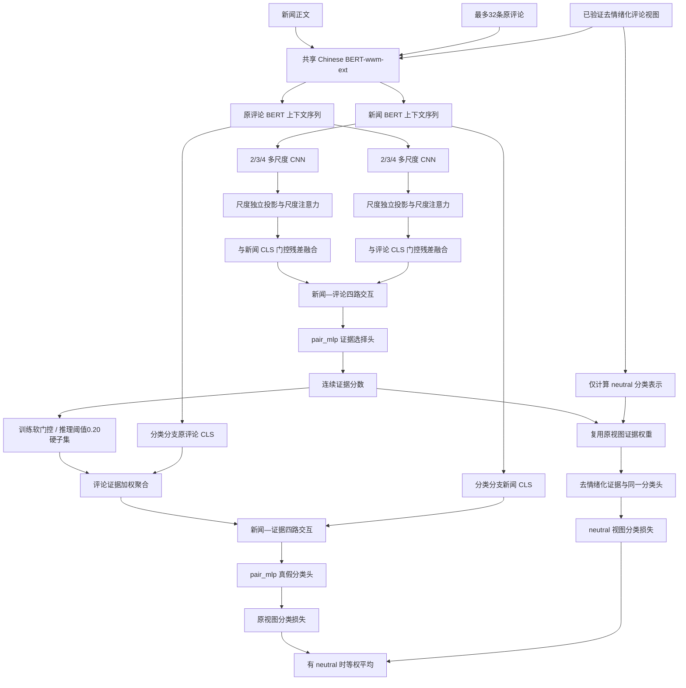

# 第五节课最终候选架构详细说明：去情绪化双视图动态证据选择网络

## 1. 文档定位

本文说明当前已经在 Dev 集冻结、但尚未运行 Test 集的最终候选架构。当前方案不是旧阶段总结中的 original-only、阈值 0.60，也不是包含生成负评论排序的“双头完整模型”，而是：

> 共享 Chinese BERT-wwm-ext 编码新闻与评论；选择分支用 BERT 上下文序列、多尺度 CNN、尺度注意力和门控残差构造新闻—评论相关性表示；分类分支用 BERT `[CLS]` 聚合动态评论证据；训练时对少量已验证的原评论/去情绪化评论使用双视图分类监督；推理时按统一阈值 0.20 形成数量可变的评论硬子集。

为避免名称歧义，本文将该方案简称为 **neutral-only 动态证据选择模型**。“neutral-only”表示最终增强主线只使用去情绪化双视图，不使用纯干扰/纯立场评论的排序损失；它不表示训练集只包含去情绪化评论，也不表示所有评论都存在去情绪化版本。

当前状态应表述为“Dev 冻结最终候选”。Test 尚未执行，因此不能写成“最终测试模型”或宣称测试性能提升。

## 2. 最终候选配置

| 模块 | 当前设置 |
|---|---|
| 主架构 | `dynamic_evidence` |
| 共享编码器 | `chinese-bert-wwm-ext` |
| BERT 隐藏维度 | `H=768` |
| 选择表示 | `bert_cnn_scale_attn` |
| 分类表示 | `bert_cls` |
| CNN 通道数 | 每个尺度 `128` |
| CNN 卷积核 | `2 / 3 / 4` |
| 选择头 | `pair_mlp: 4H -> H -> 1` |
| 分类头 | `pair_mlp: 4H -> H -> 2` |
| 新闻最大长度 | `256` |
| 单条评论最大长度 | `96` |
| 每条新闻最多证据评论 | `32` |
| 训练批大小 | `4` |
| 训练轮数 | `3` |
| 学习率 | `2e-5` |
| Weight decay | `0.01` |
| Dropout | `0.1` |
| 选择温度 | `1.0` |
| 最终推理阈值 | `0.20` |
| 最少保留评论数 | `1`（仅在存在评论时） |
| 选择负例数 | `0` |
| 负例排序损失权重 | `0` |
| 稀疏损失权重 | `0` |
| 语义一致性损失权重 | `0` |
| 立场一致性损失权重 | `0` |

`src/config.py` 中的默认值是通用兼容默认值，不等于上表的最终实验配置。最终操作点以冻结 checkpoint 和分析时统一覆盖的 `selection_threshold=0.20` 为准。

## 3. 总体结构



模型包含两个粒度不同的自适应过程：

1. **文本内部的尺度注意力**：决定当前新闻或评论更依赖 2-gram、3-gram 还是 4-gram 局部模式。
2. **评论集合上的动态选择**：决定当前新闻应该保留哪些评论作为分类证据。

尺度注意力解决“单条文本如何表示”，动态选择解决“多条评论如何组织”。这两个问题被显式拆开，而不是全部交给一个更深的 MLP 隐式学习。

## 4. 输入数据与评论路由

### 4.1 基础字段

每条样本至少包含：

- 新闻正文 `text`；
- 新闻真假标签 `label`；
- 原评论列表 `comments`；
- 评论级标签 `comment_labels`；
- 评论类型 `comment_types`；
- 与原评论逐位置对齐的 `neutralized_comments`；
- 去情绪化结果是否通过验证的 `neutralized_comment_validated`。

评论级标签中，`-1` 表示没有评论选择监督的原评论，`0` 表示生成的纯干扰或纯立场负例。数据加载时只有“验证标记为真且文本非空”的去情绪化评论才会被保留，否则该位置自动回退为原评论。

### 4.2 最终主模型实际使用哪些评论

训练文件物理上包含 494 条生成负评论，但最终 neutral-only 配置将它们完全排除：

1. `pure_distractor` 和 `stance_only` 且标签为 0 的评论先从分类证据索引中剔除；
2. `max_selector_negatives=0`，因此它们也不会进入负例排序张量；
3. `selector_loss_weight=0`，最终损失中不存在负例排序项。

所以最终主模型不能描述成“使用纯干扰/纯立场评论进行半监督选择训练”。这些评论只服务于已经完成的共享头和双头消融实验。

### 4.3 去情绪化增强的覆盖范围

当前增强数据的准确口径是：

> raw 基础数据 + 从 clean 来源迁移并重新对齐验证的增强资产。

训练集共有 6120 条样本，保留 945822 条原始评论。去情绪化视图覆盖 84 条训练样本、1888 条已验证评论；在每条新闻最多取前 32 条证据评论的限制下，可见 1854 条，覆盖样本仍为 84 条。也就是说，增强覆盖只占训练样本的一小部分，模型主体仍然由原始数据训练。

Dev 和 Test 文件是 raw 数据的原样副本，不包含训练用增强视图。增强的作用只能通过训练得到的参数迁移到 Dev/Test，而不是在评估时给模型额外信息。

## 5. 共享 BERT 编码器

新闻与评论使用同一个可微调的 Chinese BERT-wwm-ext。对第 `n` 条新闻和它的第 `i` 条评论：

$$
\mathbf{H}^{x}_n=E_{\mathrm{BERT}}(x_n)\in\mathbb{R}^{L_x\times H},
$$

$$
\mathbf{H}^{c}_{ni}=E_{\mathrm{BERT}}(c_{ni})\in\mathbb{R}^{L_c\times H},
$$

其中 `H=768`，新闻最大长度 `L_x=256`，评论最大长度 `L_c=96`。对应的全局表示是序列首位 `[CLS]`：

$$
\mathbf{g}^{x}_n=\mathbf{H}^{x}_n[0],\qquad
\mathbf{g}^{c}_{ni}=\mathbf{H}^{c}_{ni}[0].
$$

同一份 BERT 输出被两个任务分支复用：

- 选择分支读取完整 token 上下文序列，继续提取局部模式；
- 分类分支直接使用 `[CLS]`，保留稳定的全局语义。

这种设计只加载一套 BERT，新闻、评论、选择模块与分类模块处在同一语义空间。最终分类梯度会共同更新共享 BERT，但两个分支后续的表示变换彼此独立。

在实现中，评论张量先从 `[B,M,L_c]` 展平为 `[B\times M,L_c]` 统一编码，再恢复为 `[B,M,H]`；其中 `B` 是 batch size，`M<=32` 是评论数。

## 6. 选择分支：多尺度局部表示

### 6.1 为什么选择分支不只使用 `[CLS]`

新闻评论中的判别线索可能是局部短语、否定组合、立场表达、实体—事件搭配或较短的事实片段。只使用 `[CLS]` 会让这些局部模式完全依赖 Transformer 自行压缩；直接使用普通 TextCNN 又会丢失 BERT 已经建立的上下文语义。

因此当前结构先使用 BERT 生成上下文化 token 表示，再在其上执行多尺度 CNN。CNN 不是替代 BERT，而是作为 BERT 全局语义的局部补充。

### 6.2 多尺度 CNN

卷积核集合为：

$$
\mathcal{K}=\{2,3,4\}.
$$

对任意新闻或评论上下文序列 $\mathbf{H}^{t}$，第 `k` 个卷积分支计算：

$$
\mathbf{A}^{t}_{k}=\operatorname{GELU}(\operatorname{Conv1D}_{k}(\mathbf{H}^{t})).
$$

每个尺度输出 128 个通道，再沿序列维执行最大池化：

$$
\mathbf{u}^{t}_{k}=\operatorname{MaskedMaxPool}(\mathbf{A}^{t}_{k})\in\mathbb{R}^{128}.
$$

实现会先把 padding token 的输入特征置零，并屏蔽完全由 padding 构成的卷积窗口；含有效 token 的边界窗口可以保留。若整段文本没有有效 token，则返回零向量，避免空评论产生伪特征。

三种卷积核的直观作用是：

- `k=2`：更敏感于短否定、紧邻词组和短立场组合；
- `k=3`：捕捉较完整的三元短语和局部语义结构；
- `k=4`：覆盖更长的事实片段和短句级组合。

这里的含义是感受野差异，不应机械解释为严格的语言学二元、三元、四元词组，因为 BERT token 可能是字、词片段或特殊符号。

### 6.3 尺度独立投影

旧 `bert_cnn` 会把三个尺度直接拼接，再通过一个线性层统一混合。当前 `bert_cnn_scale_attn` 保留三个尺度的身份，每个尺度使用独立投影：

$$
\mathbf{v}^{t}_{k}
=\operatorname{LayerNorm}\left(
\operatorname{GELU}(\mathbf{W}_{k}\mathbf{u}^{t}_{k}+\mathbf{b}_{k})
\right)\in\mathbb{R}^{H}.
$$

独立投影有两个作用：

1. 把 128 维 CNN 通道映射回 768 维 BERT 空间，便于后续融合；
2. 避免不同卷积尺度在注意力之前被过早混合。

### 6.4 缩放点积尺度注意力

先对三个尺度求均值：

$$
\bar{\mathbf{v}}^{t}=\frac{1}{3}\sum_{k\in\mathcal{K}}\mathbf{v}^{t}_{k}.
$$

再将当前文本的 `[CLS]` 与尺度均值拼接，生成查询：

$$
\mathbf{q}^{t}=\tanh\left(
\mathbf{W}_{q}[\mathbf{g}^{t};\bar{\mathbf{v}}^{t}]+\mathbf{b}_{q}
\right).
$$

第 `k` 个尺度的注意力权重为：

$$
\alpha^{t}_{k}
=\operatorname{softmax}_{k}\left(
\frac{(\mathbf{q}^{t})^{\top}\mathbf{v}^{t}_{k}}{\sqrt{H}}
\right).
$$

最终局部向量为：

$$
\mathbf{l}^{t}=\sum_{k\in\mathcal{K}}\alpha^{t}_{k}\mathbf{v}^{t}_{k}.
$$

`1/sqrt(H)` 用于缩放 768 维点积，避免 softmax 在训练初期因数值过大而过早饱和。注意力权重随每条新闻或评论变化，因此模型不是固定偏好某一个卷积核。

这里的注意力只发生在同一文本的三个 CNN 尺度之间，不是新闻—评论注意力，也不是跨评论注意力。

### 6.5 与 `[CLS]` 的门控残差融合

局部向量先进行非线性变换：

$$
\tilde{\mathbf{l}}^{t}
=\operatorname{Dropout}(\operatorname{GELU}(\mathbf{W}_{l}\mathbf{l}^{t}+\mathbf{b}_{l})).
$$

然后用 `[CLS]` 与局部特征共同生成逐维门控：

$$
\mathbf{a}^{t}=\sigma\left(
\mathbf{W}_{g}[\mathbf{g}^{t};\tilde{\mathbf{l}}^{t}]+\mathbf{b}_{g}
\right).
$$

选择表示为：

$$
\mathbf{r}^{t}=\operatorname{LayerNorm}\left(
\mathbf{g}^{t}+\mathbf{a}^{t}\odot\tilde{\mathbf{l}}^{t}
\right).
$$

残差主路保留 BERT `[CLS]`，CNN 只在门控允许的维度上修正全局表示。这样比“完全用 CNN 替换 `[CLS]`”更稳定，也比简单拼接后直接交给更深 MLP 更容易优化。

该过程分别产生新闻选择表示 $\mathbf{r}^{x}_n$ 和每条评论的选择表示 $\mathbf{r}^{c}_{ni}$。

## 7. 新闻—评论关系选择头

评论价值取决于它与当前新闻的关系，而不是评论自身是否情绪强烈或内容丰富。对新闻和第 `i` 条评论构造四路交互：

$$
\mathbf{z}^{\mathrm{sel}}_{ni}=
[\mathbf{r}^{x}_n;
\mathbf{r}^{c}_{ni};
|\mathbf{r}^{x}_n-\mathbf{r}^{c}_{ni}|;
\mathbf{r}^{x}_n\odot\mathbf{r}^{c}_{ni}]
\in\mathbb{R}^{4H}.
$$

四部分分别承担：

- 新闻原向量：保留事件背景和主体语义；
- 评论原向量：保留评论自身内容；
- 绝对差：描述新闻与评论的语义偏离程度；
- 逐元素乘积：描述二者在各语义维度上的匹配与一致关系。

选择头采用浅层 `pair_mlp`：

```text
4H -> H -> 1
Linear -> GELU -> Dropout(0.1) -> Linear
```

输出 logit $s_{ni}$，经温度为 `T=1` 的 sigmoid 得到连续证据分数：

$$
p_{ni}=\sigma(s_{ni}/T).
$$

最终没有评论级“有用/无用”标签损失。$p_{ni}$ 由新闻真假分类目标间接学习，语义是“该评论参与证据融合后对当前任务是否有帮助”，不是经过校准的客观有用概率。

`pair_mlp` 看似较浅，但它之前已有共享 BERT、多尺度 CNN、尺度注意力、门控残差和显式四路关系特征。实验中继续加深选择头产生了概率饱和或跨 seed 不稳定，因此最终选择“结构化表示 + 浅任务头”，而不是继续堆层。

## 8. 训练软门控与推理硬选择

### 8.1 训练阶段：连续软门控

训练时不按阈值删除评论，而是让所有有效证据评论通过连续分数参与融合：

$$
\gamma^{\mathrm{train}}_{ni}=m_{ni}p_{ni},
$$

其中 $m_{ni}$ 是有效评论掩码。训练权重为：

$$
w^{\mathrm{train}}_{ni}
=\frac{\gamma^{\mathrm{train}}_{ni}}
{\max(1,\sum_j\gamma^{\mathrm{train}}_{nj})}.
$$

分母下限设为 1，而不是始终除以概率总和。当全部概率总质量小于 1 时，整体降低概率会同步缩小证据向量，模型不能通过把所有概率一起压低、同时保持归一化比例不变来逃避代价。

训练使用软门控的核心原因是保持可微。分类损失可以沿以下路径反向传播：

```text
分类损失
 -> 新闻—证据分类头
 -> 评论证据向量
 -> 连续证据权重
 -> 选择 pair_mlp
 -> 门控残差
 -> 尺度注意力
 -> 多尺度 CNN
 -> 共享 BERT
```

### 8.2 Dev/推理阶段：动态硬子集

评估阶段使用冻结阈值 `tau=0.20`：

$$
\mathcal{S}_n(\tau)=\{i\mid m_{ni}=1,\ p_{ni}\ge\tau\}.
$$

若样本存在评论但没有评论超过阈值，则补选分数最高的一条：

$$
\mathcal{S}_n(\tau)=\{\arg\max_i p_{ni}\}.
$$

如果样本本身没有评论，则不会凭空补出评论。此时证据向量为零，分类器仍可根据新闻表示及其与零证据的关系进行预测。

硬子集外评论在推理时权重严格为 0；硬子集内仍按原证据分数归一化：

$$
w^{\mathrm{eval}}_{ni}
=\frac{p_{ni}\mathbb{I}[i\in\mathcal{S}_n]}
{\sum_j p_{nj}\mathbb{I}[j\in\mathcal{S}_n]+\epsilon}.
$$

所以当前方法同时包含：

- **离散选择**：阈值决定评论是否进入硬子集；
- **连续加权**：被保留评论的重要性仍有差异。

它不是固定 top-k，也不是对全部评论做普通注意力池化。

### 8.3 阈值 0.20 的含义

阈值 0.20 是在三个随机种子的同一 Dev 网格上冻结的操作点。它取得最高平均 Macro-F1 `0.954234`，平均评论保留率 `0.578355`。阈值 0.05 的平均 Macro-F1 为 `0.954226`，几乎相同，但平均保留率达到 `0.749720`，因此 0.20 在平均分类性能略高的同时少保留约 17.14 个百分点。

由于选择分数没有概率校准，0.20 不能解释成“评论有 20% 以上概率是有用证据”，也不能直接迁移到另一个数据集或另一套表示结构。

## 9. 分类分支与证据聚合

### 9.1 为什么分类分支仍使用 BERT `[CLS]`

选择分支需要对局部短语敏感，因此使用多尺度 CNN；分类分支需要在聚合后稳定判断新闻与整体证据的关系，因此保留普通 `bert_cls`。实验中将分类分支也改成 CNN、再叠加门控残差或更复杂分类头，并没有获得稳定的跨 seed 增益。

这种非对称设计不是“选择器先进、分类器简单”，而是功能分工：

- 选择器负责发现细粒度局部线索和新闻—评论相关性；
- 分类器负责对已经组织好的集合级证据做稳健决策。

### 9.2 评论证据向量

分类分支直接取共享 BERT 的评论 `[CLS]`：

$$
\mathbf{c}_{ni}=\mathbf{H}^{c}_{ni}[0].
$$

用训练或推理阶段对应的权重聚合：

$$
\mathbf{e}_{n}=\sum_i w_{ni}\mathbf{c}_{ni}\in\mathbb{R}^{H}.
$$

这里没有再次平均所有评论，也没有把评论文本简单拼接成超长序列。每条新闻得到一个固定 768 维的集合级证据向量。

### 9.3 新闻—证据四路交互分类

分类器不是把新闻 `[CLS]` 直接接线性层，而是再次构造四路关系：

$$
\mathbf{z}^{\mathrm{cls}}_n=
[\mathbf{g}^{x}_n;
\mathbf{e}_n;
|\mathbf{g}^{x}_n-\mathbf{e}_n|;
\mathbf{g}^{x}_n\odot\mathbf{e}_n]
\in\mathbb{R}^{4H}.
$$

分类 `pair_mlp` 为：

```text
4H -> H -> 2
Linear -> GELU -> Dropout(0.1) -> Linear
```

输出真假二分类 logits。这个设计显式建模“新闻自身”“评论证据”“二者差异”和“二者匹配”，适合假新闻检测中证据与声明之间的关系判断。

## 10. 去情绪化双视图分类

### 10.1 双视图如何构造

对存在验证通过改写的位置，用去情绪化评论替换原评论；其余位置仍使用原评论。于是每个覆盖样本得到两套逐位置对齐的评论：

```text
原视图：       c_1, c_2, ..., c_M
neutral视图： c'_1,c'_2,...,c'_M
```

其中没有验证改写的位置满足 $c'_i=c_i$。

### 10.2 为什么 neutral 视图不重新运行选择器

选择器只根据原评论计算一次证据权重 $w_{ni}$。neutral 分支只重新计算分类表示，并复用同一组权重：

$$
\mathbf{e}^{\mathrm{neu}}_n
=\sum_i w_{ni}\mathbf{c}'_{ni}.
$$

这样设计有三点作用：

1. 原视图与 neutral 视图比较的是相同评论位置，避免“换文本同时换选择结果”造成混杂；
2. neutral 分支只约束分类对情绪表达变化的鲁棒性，不直接把生成文本当作新的选择依据；
3. 选择器仍会从 neutral 分类损失获得梯度，因为 neutral 证据向量复用了未分离的原视图权重。

neutral 证据和原新闻 `[CLS]` 经过同一个分类头，所有分类参数完全共享。

### 10.3 双视图损失

对没有有效 neutral 评论的样本：

$$
\mathcal{L}_n=\operatorname{CE}(\mathbf{o}^{\mathrm{orig}}_n,y_n).
$$

对至少包含一条有效 neutral 评论的样本：

$$
\mathcal{L}_n=
\frac{1}{2}\left[
\operatorname{CE}(\mathbf{o}^{\mathrm{orig}}_n,y_n)
+\operatorname{CE}(\mathbf{o}^{\mathrm{neu}}_n,y_n)
\right].
$$

最后对 batch 内样本取平均。每个覆盖样本的总权重仍为 1，不会因为拥有两个视图就在 batch 中被简单放大为普通样本的两倍。

`semantic_loss_weight=0` 和 `stance_loss_weight=0` 只关闭额外的证据余弦一致性与预测 KL 一致性正则，不会关闭上面的双视图交叉熵。当前 neutral-only 的增强收益来自双视图分类监督，而不是额外一致性损失。

## 11. 最终损失与梯度作用范围

代码支持的通用损失是：

$$
\mathcal{L}=
\mathcal{L}_{\mathrm{cls}}
+\lambda_{\mathrm{rank}}\mathcal{L}_{\mathrm{rank}}
+\lambda_{\mathrm{sparse}}\mathcal{L}_{\mathrm{sparse}}
+\lambda_{\mathrm{sem}}\mathcal{L}_{\mathrm{sem}}
+\lambda_{\mathrm{stance}}\mathcal{L}_{\mathrm{stance}}.
$$

最终主模型设置为：

$$
\lambda_{\mathrm{rank}}
=\lambda_{\mathrm{sparse}}
=\lambda_{\mathrm{sem}}
=\lambda_{\mathrm{stance}}=0.
$$

所以最终目标可简写为：

$$
\mathcal{L}=\mathcal{L}_{\mathrm{dual\text{-}view\ classification}}.
$$

尽管没有显式选择器监督，选择器并没有被冻结。原视图和 neutral 视图的分类损失都能通过连续证据权重反向传播到选择器。因此当前选择器学习的是“什么评论权重能让真假分类损失更低”，属于任务驱动的潜变量式证据选择。

## 12. 训练、验证与 checkpoint

### 12.1 优化流程

- 优化器：AdamW；
- 学习率：`2e-5`；
- weight decay：`0.01`；
- 线性学习率计划，前 10% step warmup；
- 梯度范数裁剪：`1.0`；
- 训练 3 个 epoch；
- 每个随机种子固定 Python、NumPy、PyTorch 和 CUDA 随机源，并关闭 cuDNN benchmark。

### 12.2 checkpoint 保存规则

每个 epoch 后在 Dev 上评估，只有 Macro-F1 严格提高时才覆盖保存：

- `encoder/`：BERT 与 tokenizer；
- `model.pt`：完整模型参数；
- `config.json`：训练配置；
- `metrics.json`：保存时的 Dev 指标。

训练时不传 `--test` 就不会访问 Test。用户已经决定暂缓 Test，因此当前所有结论都停留在 Dev 冻结阶段。

### 12.3 当前三个评估实例的特殊说明

概念上的最终架构是单证据头 neutral-only，但当前三 seed 结果复用了已有 checkpoint：

- seed 42：`outputs/neutral_only_orig_transfer_s42_scaleattn_t060`；
- seed 43：`outputs/neutral_only_orig_transfer_s43_scaleattn_t000`；
- seed 44：`outputs/full_orig_transfer_s44_dual_sw01_t000`，分析时将拒绝权重覆盖为 0。

seed 44 的物理 checkpoint 包含独立拒绝头，但拒绝权重为 0 时，最终选择分数和分类证据只来自证据头。此前的梯度隔离检查证明双头训练不改变证据头与分类主路径，因此它可以作为 seed 44 neutral-only 的等价代理。正式架构图和方法描述不应把拒绝头画进最终主模型。

三个 checkpoint 的最终 Dev 复评统一覆盖阈值 0.20。checkpoint 名称中的 `t060` 或 `t000` 记录的是训练时 Dev 保存所用操作点，不是当前统一推理阈值；这一点必须在实验表中说明。三个实例最终都保存到 epoch 3，但后续若重新完整复现，建议三个 seed 从训练开始就统一 checkpoint 选择协议，消除目录命名和保存阈值不一致。

## 13. 已排除的增强与架构分支

### 13.1 共享选择头负例排序

最初尝试用纯干扰/纯立场评论作为 selector-only 负例，并通过 margin ranking 让负例分数低于原评论。旧 stop-gradient 写法只让负例侧更新共享选择头，公共输出偏置可以整体下移，使所有评论概率一起塌缩。

`pairwise_bias_cancel` 让原评论和负例的分离特征经过同一打分头，抵消公共输出偏置梯度，修复了整体塌缩；但负例排序仍会更新负责分类证据权重的共享选择头，导致分类性能低于 neutral-only。

### 13.2 独立拒绝头

随后增加 `separate_rejection`：证据头负责分类权重，拒绝头只学习负例排序。梯度隔离验证通过，但两种组合方式都没有稳定提升三 seed：

- `centered_additive`：平均 Macro-F1 相对 neutral-only 下降约 `0.000756`；
- `one_sided_veto`：平均下降约 `0.000765`，平均仅多删除约 2.46 个百分点评论。

因此拒绝头学到了更积极地删除评论，却没有稳定学到跨随机种子泛化的“删对评论”。该分支保留在代码中用于消融和失败分析，不进入最终方法。

### 13.3 更深的选择头与分类头

项目还尝试过：

- `deep_residual` 选择头；
- `relation_pyramid` 选择头；
- `gated_residual` 分类头；
- `stable_gated_residual` 分类头；
- 选择和分类两侧都使用 CNN 表示。

这些结构增加了容量，但在当前数据规模、训练轮数和共享 BERT 微调条件下出现概率饱和、稀疏度异常或跨 seed 不稳定。最终方案保留复杂的、具有明确功能的表示模块，把任务输出头控制为浅层 MLP。

## 14. 当前 Dev 结果应如何解释

最终统一阈值 0.20 下：

| Seed | Macro-F1 | 评论保留率 | 最低补选样本数 |
|---:|---:|---:|---:|
| 42 | 0.958799 | 0.437504 | 52 |
| 43 | 0.958805 | 0.543301 | 45 |
| 44 | 0.945098 | 0.754260 | 9 |
| 均值 | 0.954234 | 0.578355 | — |
| 样本标准差 | 0.007912 | 0.161261 | — |

可以支持的结论是：

- 去情绪化双视图与当前选择架构组合后，在 Dev 上得到可用的平均分类性能；
- 阈值 0.20 相比不筛选能明显减少进入分类器的评论数量，同时保持或略微提高平均 Macro-F1；
- 动态选择不是依赖大量最低补选维持，因为多数有评论样本仍有评论自然超过阈值；
- 负例拒绝分支没有表现出稳定额外收益，应作为消融而非主方法。

不能过度解释的地方是：

- 只有 3 个随机种子，不能宣称统计显著；
- seed 44 明显低于 seed 42/43，模型仍存在随机种子敏感性；
- 评论保留率的跨 seed 标准差较大，选择分数标尺仍不够稳定；
- neutral 增强只覆盖 84/6120 条训练样本，不能声称模型已经全面学会情绪不变性；
- raw 数据仍保留强标签线索，当前结果不能证明模型摆脱了数据偏差；
- 增强资产来源于 clean 阶段再迁移，不能表述为完全基于 raw 评论重新生成；
- Test 尚未运行，不能报告最终泛化性能。

## 15. 各模块作用总结

| 模块 | 输入 | 输出 | 主要作用 |
|---|---|---|---|
| 共享 BERT | 新闻或评论 token | 上下文序列 `[L,H]` | 建立全局和上下文语义空间 |
| 多尺度 CNN | BERT token 序列 | 三个 `[128]` 尺度向量 | 提取不同长度的局部模式 |
| 尺度独立投影 | 各尺度 CNN 向量 | 三个 `[H]` 向量 | 保留尺度身份并对齐 BERT 空间 |
| 尺度注意力 | `[CLS]` 与三个尺度 | 局部融合向量 `[H]` | 按文本实例选择合适局部尺度 |
| 门控残差 | `[CLS]` 与局部向量 | 选择表示 `[H]` | 稳定地把局部信息注入全局语义 |
| 选择四路交互 | 新闻与单评论选择表示 | `[4H]` | 显式表达自身、差异与匹配关系 |
| 选择 pair_mlp | `[4H]` | 单评论证据分数 | 学习任务驱动的评论重要性 |
| 动态硬选择 | 评论分数与阈值 | 数量可变评论子集 | 推理时真正删除低分评论 |
| 证据聚合 | 评论 CLS 与证据权重 | 证据向量 `[H]` | 把评论集合压缩成新闻级证据 |
| 分类四路交互 | 新闻 CLS 与证据向量 | `[4H]` | 建模新闻与评论证据的关系 |
| 分类 pair_mlp | `[4H]` | 两类 logits | 输出真假预测 |
| neutral 双视图 | 对齐的原/去情绪化评论 | 两套分类 logits | 降低分类对情绪表达的依赖 |

## 16. 代码位置对照

| 内容 | 主要文件与位置 |
|---|---|
| 数据字段、评论对齐与路由 | `src/data.py` |
| 多尺度 CNN | `src/model.py` 中 `MultiScaleTextCNN` |
| BERT/CNN/尺度注意力表示 | `src/model.py` 中 `TokenRepresentation` |
| 动态选择、证据聚合、neutral 双视图与损失 | `src/model.py` 中 `DynamicEvidenceSelectionModel` |
| 配置结构 | `src/config.py` 中 `TrainConfig` |
| 训练、Dev 保存和评估指标 | `src/train.py` |
| 选择概率、阈值、补选和评论类型诊断 | `scripts/analyze_selector.py` |
| 历次修改、实验和失败原因 | `第五节课代码改造记录.md` |

## 17. 汇报时可以使用的完整表述

> 当前模型使用一套共享的 Chinese BERT-wwm-ext 编码新闻和评论。分类分支保留稳定的 BERT `[CLS]` 全局表示；评论选择分支则在 BERT 上下文 token 序列上加入 2、3、4 三种卷积核，分别提取不同长度的局部模式。三个尺度不直接拼接，而是先独立投影到 BERT 隐藏空间，再由当前文本的 `[CLS]` 和多尺度摘要生成查询，通过缩放点积注意力自适应选择局部尺度。融合后的局部特征以逐维门控残差方式修正 `[CLS]`，得到新闻和评论的选择表示。
>
> 对每条新闻—评论对，模型显式拼接新闻表示、评论表示、绝对差和逐元素乘积，通过浅层 MLP 得到评论证据分数。训练时使用连续软门控，使真假分类损失能够端到端更新选择器；推理时使用统一阈值 0.20 构造数量可变的评论硬子集，若有评论但全部低于阈值，则只补选最高分的一条。被保留评论的 BERT `[CLS]` 按证据分数归一加权形成集合级证据，再与新闻 `[CLS]` 做第二次四路交互，完成真假分类。
>
> 训练数据中少量评论具有验证通过的去情绪化改写。模型不重新选择这些生成文本，而是复用原评论得到的同一组证据权重，分别聚合原评论和去情绪化评论，并用同一分类头计算两个视图的交叉熵。这样约束分类器在评论位置和重要度不变时，对情绪表达变化保持更稳定。纯干扰和纯立场生成评论经过共享头与独立拒绝头实验后没有获得稳定的三随机种子增益，因此最终只作为消融保留，不进入主模型。

